# 💼 Paasel — Business Plan & Financial Growth Model

> **Paasel** is a next-generation hyperlocal grocery delivery marketplace built by **theScaleOn**. We empower local neighborhood Kirana stores to compete with Quick-Commerce giants through a zero-commission subscription model, delivering daily essentials within a 4 km radius in under 30 minutes.

---

## 🚀 Executive Summary

* **Company Name**: Paasel (by theScaleOn)
* **Industry**: Hyperlocal E-Commerce / Quick-Commerce Tech / Logistics
* **Core Product**: Triple-App Ecosystem (Customer, Shop Owner, Delivery Partner) + High-Concurrency FastAPI & PostGIS Engine.
* **Key Innovation**: Zero-commission subscription model (₹249/month per shop) replacing heavy 20-30% platform commissions.
* **Target Market**: Local Kirana store owners, recurring monthly ration buyers, and local delivery partners in Tier 1, 2, and 3 cities.

---

## ⚡ 1. The Market Problem

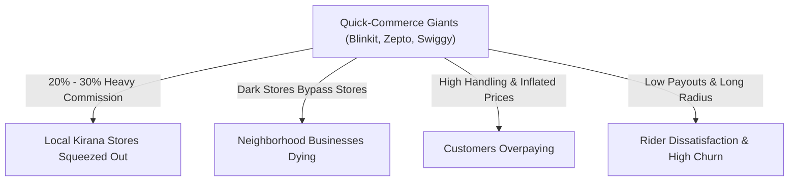

1. **Kirana Stores Being Erased**: Traditional local grocery shops are losing regular customers to dark-store quick commerce platforms.
2. **Exorbitant Platform Commissions**: Existing platforms charge 20% to 30% per order, making it impossible for small Kirana vendors to maintain profit margins.
3. **Price Inflation for Customers**: High platform fees and handling charges result in customers paying significantly higher prices for daily groceries.
4. **Unfair Logistics**: Delivery riders are underpaid and forced to cover excessive distances for low earnings.

---

## 💡 2. The Solution: Paasel Model

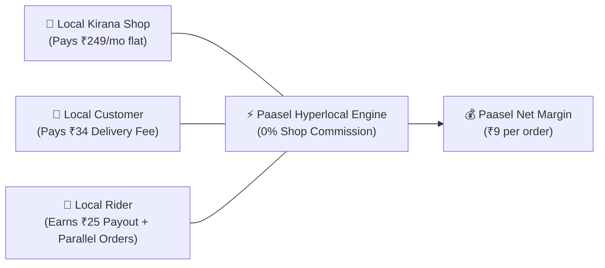

* **Shop-First Zero Commission**: Shops keep 100% of their product sales. They pay only a flat **₹249/month subscription fee** (<₹9/day).
* **Transparent Delivery Pricing**: **₹34 customer delivery fee** (₹25 rider payout | **₹9 Paasel net profit**).
* **Multi-Order Parallel Batching**: Delivery partners deliver multiple orders on the same route simultaneously, boosting rider income to **₹50–₹75+ per trip**.
* **Built-in Quality Control**: Photo verification at packing and double OTP verification (Pickup OTP + Delivery OTP) to eliminate order disputes.

---

## 🔄 3. End-to-End Operational Workflows & Flowcharts

### A. Overall Triple-App System Workflow
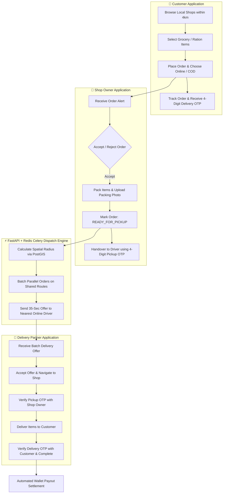

---

### B. Order Packing & Photo Verification Flowchart
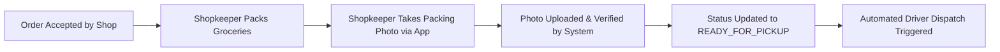

---

### C. Multi-Order Parallel Batching & Route Optimization Flowchart
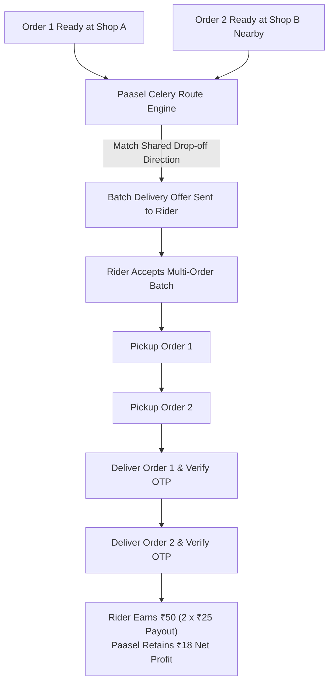

---

### D. Double-OTP Security & Anti-Fraud Flowchart
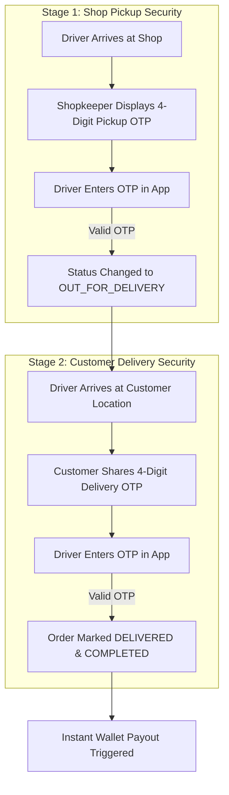

---

## 📊 4. Market Opportunity (TAM / SAM / SOM)

```
┌────────────────────────────────────────────────────────┐
│ TAM: $600 Billion                                      │
│ India Retail Grocery Market (12M+ Kirana Stores)       │
│ ┌────────────────────────────────────────────────────┐ │
│ │ SAM: $30 Billion                                   │ │
│ │ Tier 1/2/3 Hyperlocal Grocery Delivery Market      │ │
│ │ ┌────────────────────────────────────────────────┐ │ │
│ │ │ SOM: ₹50 Crore / Year                          │ │ │
│ │ │ Initial 5,000 Onboarded Stores (Next 18-24 Mo)  │ │ │
│ │ └────────────────────────────────────────────────┘ │ │
│ └────────────────────────────────────────────────────┘ │
└────────────────────────────────────────────────────────┘
```

---

## 💰 5. Unit Economics & Business Model

### A. Per-Order Unit Economics

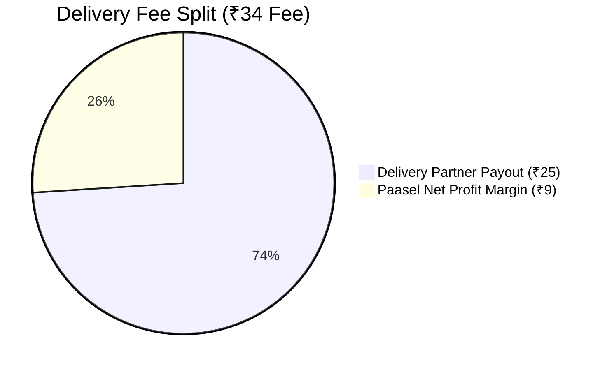

| Component | Amount | Financial Impact |
| :--- | :---: | :--- |
| **Customer Delivery Fee Charged** | **₹34** | Transparent checkout delivery charge |
| **Delivery Partner Payout** | **₹25** | Instant rider wallet credit per order |
| **Paasel Net Profit Margin** | **₹9** | **Pure platform gross margin saved per order** |

> 🛵 **Rider Parallel Batching**: Riders can carry 2–3 orders per batch on shared routes, making **₹50–₹75+ per delivery run**, driving high rider retention and fast delivery.

---

> [[NOTE]]
> ### 💡 Strategic Growth Catalyst: Promotional Free Delivery on Small Orders (<₹100)
> * **Market Gap**: Most daily household grocery items are small transactions under ₹100 (purchasing under 10 daily items). **No competitor (Blinkit, Zepto, Swiggy) provides free delivery on orders under ₹100**.
> * **Growth Strategy**: Paasel will run a **Promotional Free Delivery Campaign** for small orders during market entry.
> * **Financial Engine**: Subsidized via the **₹249/month merchant subscription fund** and optimized through **multi-order parallel route batching**. This strategy eliminates purchase friction, drastically lowers CAC, and creates viral customer adoption.

---

### B. Single Shop Unit Economics
Assuming a typical Kirana store processes **50 orders per month**:

$$\text{Monthly Revenue per Shop} = \text{Subscription Fee (₹249)} + (\text{Monthly Orders (50)} \times \text{Net Profit Margin (₹9)})$$

* **Subscription Fee**: ₹249 / month
* **Order Profit Margin (50 orders @ ₹9/order)**: $50 \times \text{₹9} = \mathbf{₹450}$
* **Total Net Monthly Profit per Shop**: **₹699 / month**

---

### C. Scaled Financial Growth Projections

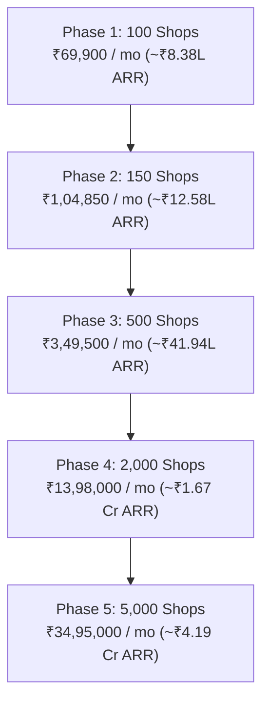

#### Detailed Financial Scaling Table:

| Metric | Phase 1 (100 Shops) | Phase 2 (150 Shops) | Phase 3 (500 Shops) | Phase 4 (2,000 Shops) | Phase 5 (5,000 Shops) |
| :--- | :---: | :---: | :---: | :---: | :---: |
| **Monthly Subscription (₹249/shop)** | ₹24,900 | ₹37,350 | ₹1,24,500 | ₹4,98,000 | ₹12,45,000 |
| **Monthly Orders (50 orders/shop)** | 5,000 | 7,500 | 25,000 | 1,00,000 | 2,50,000 |
| **Order Profit Margin (₹9/order)** | ₹45,000 | ₹67,500 | ₹2,25,000 | ₹9,00,000 | ₹22,50,000 |
| **Total Monthly Gross Profit** | **₹69,900** | **₹1,04,850** | **₹3,49,500** | **₹13,98,000** | **₹34,95,000** |
| **Annualized Revenue (ARR)** | **~₹8.38 Lakhs** | **~₹12.58 Lakhs** | **~₹41.94 Lakhs** | **~₹1.67 Crores** | **~₹4.19 Crores** |

---

## 🛡️ 6. Technology Architecture & Competitive Moat

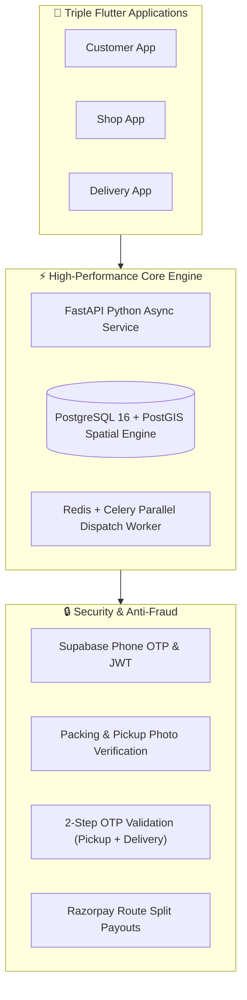

1. **PostGIS Spatial Radius Indexing**: Exact 4 km geographic boundary matching preventing unfulfillable orders.
2. **Automated Celery Parallel Batch Engine**: Dispatches multi-order offers to online riders to deliver multiple orders on shared routes.
3. **Double OTP & Photo Verification**: Prevents order loss, fraud claims, and delivery disputes.
4. **Instant Split Settlement**: Razorpay Route instantly splits item costs to shops and delivery payouts to rider wallets.

---

## 🎯 7. Go-To-Market (GTM) Strategy

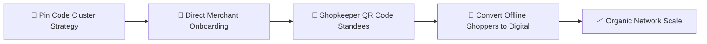

1. **Pin-Code Clustering**: Launching in concentrated clusters of 50–100 shops per locality to maximize delivery rider density.
2. **Merchant Onboarding**: Partnering with local Kirana Merchant Associations with a zero-commission pitch.
3. **Shopkeeper-Driven Customer Acquisition**: Placing Paasel QR Code standees at checkout counters. Shops convert their existing offline customers into digital monthly orderers.

---

## 💸 8. Capital Requirement & Use of Funds

### Capital Requirement Target: ₹25,000,000 (₹25 Lakhs Seed Capital)

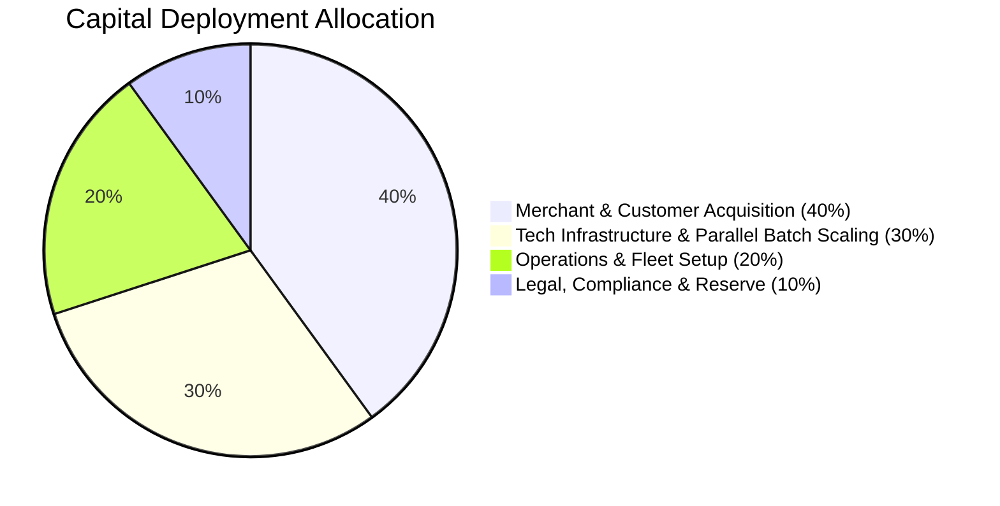

* **40% Marketing & Merchant Onboarding**: Field onboarding agents, merchant QR standees, and localized customer acquisition.
* **30% Product & Engineering**: Parallel batching routing optimization, live tracking, and analytics dashboards.
* **20% Operations & Logistics**: Driver onboarding, fleet management, and regional customer support.
* **10% Compliance & Contingency**: Legal, licensing, payment gateway reserves, and administrative setup.

---

## 🏆 9. Key Milestones & Growth Roadmap

* **Month 1 - 3**: Onboard **100 - 150 Kirana Shops**, reach **₹69,900 - ₹1,04,850 monthly gross profit**.
* **Month 4 - 6**: Expand to **500 Kirana Shops**, reach **₹3.49 Lakhs monthly gross profit** (~₹42L ARR).
* **Month 7 - 12**: Scale to **2,000 Shops across 3 cities**, reach **₹1.67 Cr ARR milestone**.
* **Month 13 - 24**: Scale to **5,000+ Shops**, achieve **₹4.19 Crore+ ARR** and launch B2B inventory restocking features for shops.

---

## 🤝 Contact & Partnership

* **Company**: Paasel (by theScaleOn)
* **Repository**: [https://github.com/amangovindrao/passel](https://github.com/amangovindrao/passel)
* **Direct Contact**: `engg.aman7djp@gmail.com`
