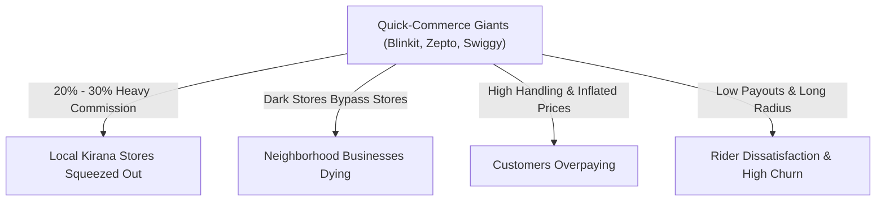
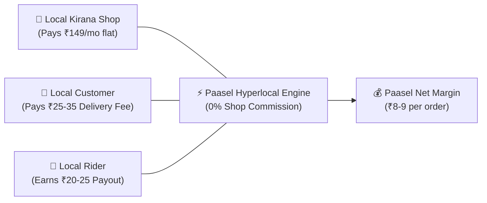
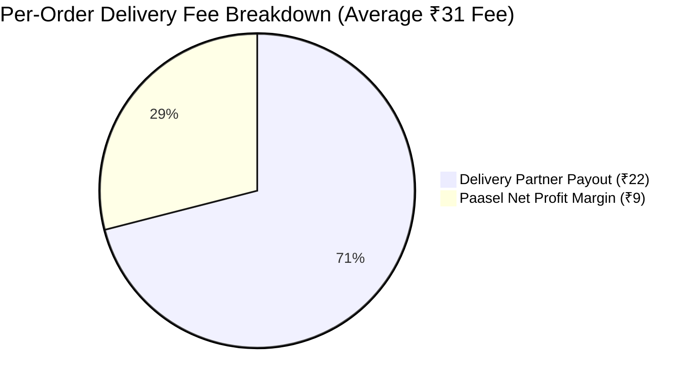
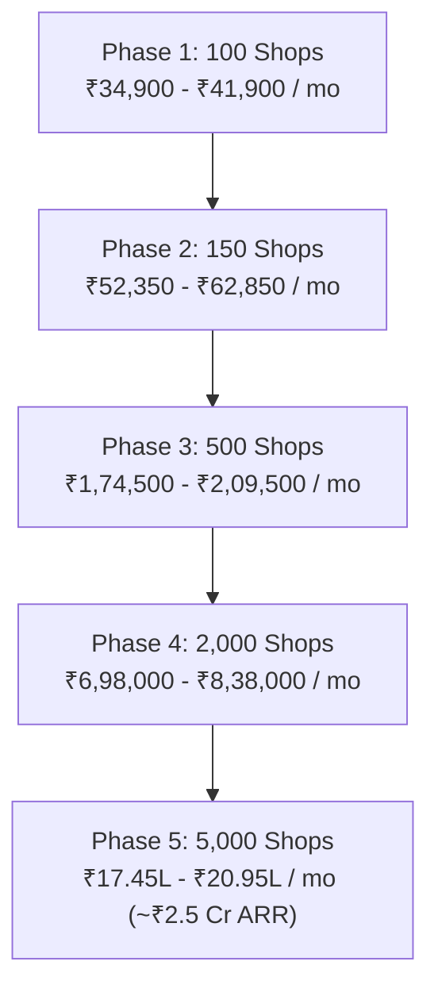
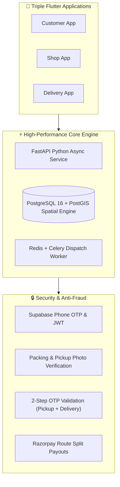
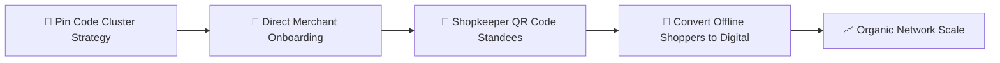
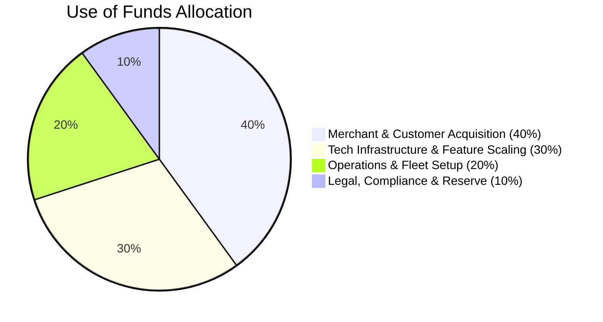

# 💼 Paasel — Investor Pitch Deck & Financial Growth Model

> **Paasel** is a next-generation hyperlocal grocery delivery marketplace built by **theScaleOn**. We empower local neighborhood Kirana stores to compete with Quick-Commerce giants through a zero-commission subscription model, delivering daily essentials within a 4 km radius in under 30 minutes.

---

## 🚀 Executive Summary

* **Company Name**: Paasel (by theScaleOn)
* **Industry**: Hyperlocal E-Commerce / Quick-Commerce Tech / Logistics
* **Core Product**: Triple-App Ecosystem (Customer, Shop Owner, Delivery Partner) + High-Concurrency FastAPI & PostGIS Engine.
* **Key Innovation**: Zero-commission subscription model (₹149/month per shop) replacing heavy 20-30% platform commissions.
* **Target Audience**: Local Kirana store owners, recurring monthly ration buyers, and local delivery partners in Tier 1, 2, and 3 cities.

---

## ⚡ 1. The Problem



1. **Kirana Stores Being Erased**: Traditional local grocery shops are losing regular customers to dark-store quick commerce platforms.
2. **Exorbitant Platform Commissions**: Existing platforms charge 20% to 30% per order, making it impossible for small Kirana vendors to maintain profit margins.
3. **Price Inflation for Customers**: High platform fees and handling charges result in customers paying significantly higher prices for daily groceries.
4. **Unfair Logistics**: Delivery riders are underpaid and forced to cover excessive distances for low earnings.

---

## 💡 2. The Solution: Paasel



* **Shop-First Zero Commission**: Shops keep 100% of their product sales. They pay only a flat **₹149/month subscription fee**.
* **Affordable Hyperlocal Delivery**: Customers pay a fair delivery fee of **₹25 to ₹35** for fast delivery within a 4 km radius.
* **Fair Rider Payouts**: Delivery partners earn **₹20 to ₹25** per order with tight, localized routes.
* **Built-in Quality Control**: Photo verification at packing and double OTP verification (Pickup OTP + Delivery OTP) to eliminate order disputes.

---

## 📊 3. Market Opportunity (TAM / SAM / SOM)

```
┌────────────────────────────────────────────────────────┐
│ TAM: $600 Billion                                      │
│ India Retail Grocery Market (12M+ Kirana Stores)       │
│ ┌────────────────────────────────────────────────────┐ │
│ │ SAM: $30 Billion                                   │ │
│ │ Tier 1/2/3 Hyperlocal Grocery Delivery Market      │ │
│ │ ┌────────────────────────────────────────────────┐ │ │
│ │ │ SOM: ₹25 Crore / Year                          │ │ │
│ │ │ Initial 5,000 Onboarded Stores (Next 18-24 Mo)  │ │ │
│ │ └────────────────────────────────────────────────┘ │ │
│ └────────────────────────────────────────────────────┘ │
└────────────────────────────────────────────────────────┘
```

---

## 💰 4. Unit Economics & Business Model

### A. Per-Order Unit Economics
For every ration/grocery order processed through Paasel:



| Component | Fee Structure | Investor Impact |
| :--- | :--- | :--- |
| **Delivery Fee Charged to Customer** | ₹25 – ₹35 | Paid directly at checkout |
| **Delivery Partner Payout** | ₹20 – ₹25 | Instant rider wallet credit |
| **Paasel Net Profit Margin** | **₹8 – ₹9** | **Pure platform gross margin per order** |

---

### B. Single Shop Unit Economics
Assuming a typical Kirana store has **5 regular monthly ration customers** placing **5 to 6 orders per month** ($\approx$ **25 to 30 orders/month**):

$$\text{Monthly Revenue per Shop} = \text{Subscription Fee (₹149)} + (\text{Orders} \times \text{Net Profit Margin})$$

* **Subscription Fee**: ₹149 / month
* **Order Profit Margin**:
  * $25 \text{ orders} \times \text{₹8} = \text{₹200}$
  * $30 \text{ orders} \times \text{₹9} = \text{₹270}$
* **Total Net Monthly Profit per Shop**: **₹349 to ₹419 / month**

---

### C. Scaled Financial Growth Projections



#### Detailed Financial Scaling Table:

| Metric | Phase 1 (100 Shops) | Phase 2 (150 Shops) | Phase 3 (500 Shops) | Phase 4 (2,000 Shops) | Phase 5 (5,000 Shops) |
| :--- | :---: | :---: | :---: | :---: | :---: |
| **Monthly Subscription Revenue (₹149/shop)** | ₹14,900 | ₹22,350 | ₹74,500 | ₹2,98,000 | ₹7,45,000 |
| **Monthly Orders Delivered (25 - 30/shop)** | 2,500 - 3,000 | 3,750 - 4,500 | 12,500 - 15,000 | 50,000 - 60,000 | 1,25,000 - 1,50,000 |
| **Order Profit Margin Earnings (₹8 - ₹9)** | ₹20,000 - ₹27,000 | ₹30,000 - ₹40,500 | ₹1,00,000 - ₹1,35,000 | ₹4,00,000 - ₹5,40,000 | ₹10,00,000 - ₹13,50,000 |
| **Total Monthly Gross Profit** | **₹34,900 - ₹41,900** | **₹52,350 - ₹62,850** | **₹1,74,500 - ₹2,09,500** | **₹6,98,000 - ₹8,38,000** | **₹17,45,000 - ₹20,95,000** |
| **Annualized Recurring Revenue (ARR)** | **~₹5.0 Lakhs** | **~₹7.5 Lakhs** | **~₹25.1 Lakhs** | **~₹1.00 Crore** | **~₹2.51 Crores** |

---

## 🛡️ 5. Technology Architecture & Competitive Moat



1. **PostGIS Spatial Radius Indexing**: Exact 4 km geographic boundary matching preventing unfulfillable orders.
2. **Automated Celery Driver Dispatch Cascade**: 35-second order offer window cascading to nearby online riders to guarantee <30 min delivery.
3. **Double OTP & Photo Verification**: Prevents order loss, fraud claims, and delivery disputes.
4. **Instant Split Settlement**: Razorpay Route instantly splits item costs to shops and delivery payouts to rider wallets.

---

## 🎯 6. Go-To-Market (GTM) Strategy



1. **Pin-Code Clustering**: Launching in concentrated clusters of 50–100 shops per locality to maximize delivery rider density.
2. **Merchant Merchant Onboarding**: Partnering with local Kirana Merchant Associations with a zero-commission pitch.
3. **Shopkeeper-Driven Customer Acquisition**: Placing Paasel QR Code standees at checkout counters. Shops convert their existing offline customers into digital monthly orderers.

---

## 💸 7. Investment Ask & Use of Funds

### Funding Target: ₹25,000,000 (₹25 Lakhs Seed Capital)



* **40% Marketing & Sales**: Field onboarding agents, merchant QR standees, and localized customer acquisition.
* **30% Product & Engineering**: Enhancing real-time tracking, AI batching algorithm, and automated analytics dashboard.
* **20% Operations & Logistics**: Driver onboarding, fleet management, and regional customer support.
* **10% Compliance & Contingency**: Legal, licensing, payment gateway reserves, and administrative setup.

---

## 🏆 8. Key Milestones & Roadmap

* **Month 1 - 3**: Onboard **100 - 150 Kirana Shops**, validate unit economics in 2 target pin codes.
* **Month 4 - 6**: Expand to **500 Kirana Shops**, reach **₹2.0 Lakhs+ monthly gross profit**.
* **Month 7 - 12**: Scale to **2,000 Shops across 3 cities**, reach **₹1 Crore ARR milestone**.
* **Month 13 - 24**: Scale to **5,000+ Shops**, achieve **₹2.5 Crore+ ARR** and launch B2B inventory restocking features for shops.

---

## 🤝 Contact Information

* **Company**: Paasel (by theScaleOn)
* **Website / Repo**: [https://github.com/amangovindrao/passel](https://github.com/amangovindrao/passel)
* **Pitch Contact**: `engg.aman7djp@gmail.com`
