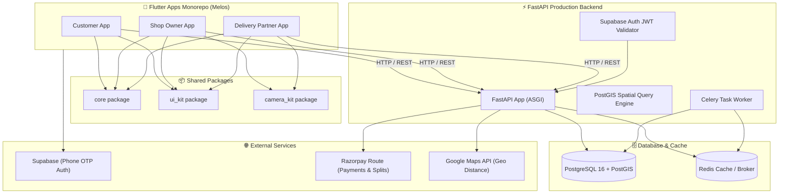
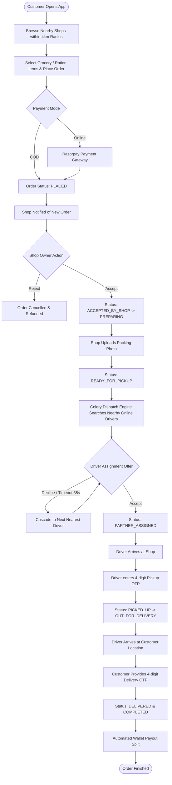
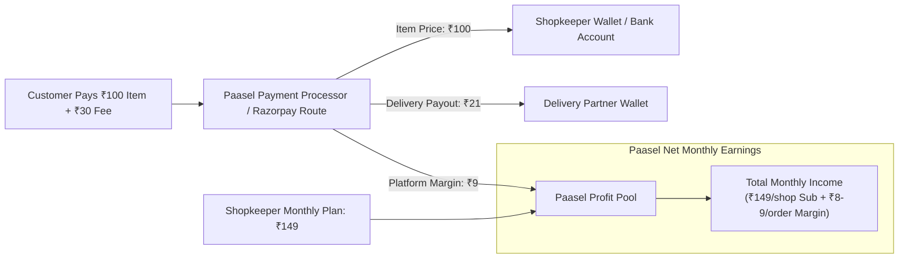

# 🚀 Paasel — Complete Project Overview, Architecture & Financial Model

> **Paasel** is a hyperlocal delivery marketplace application built by **theScaleOn**. It connects local neighborhood retail shops (kirana/grocery stores) with nearby regular customers and local delivery partners for fast, seamless, and trackable delivery.

---

## 📌 1. Project Overview (In Short Points)

* **Hyperlocal Focus**: Connects local retail shops with customers within a 4 km delivery radius using PostGIS geographic spatial indexing.
* **Triple-App Ecosystem**:
  1. **Customer App** (Flutter): Browse local catalog, place recurring ration/grocery orders, live track delivery, OTP verification.
  2. **Shop Owner App** (Flutter): Inventory/product management, order acceptance, packing photo verification, subscription status tracking.
  3. **Delivery Partner App** (Flutter): Order assignment notification (Fresh & Batch detour), route navigation, pickup/delivery OTP validation, wallet earnings.
* **Robust FastAPI Backend**: High-performance Python backend with PostgreSQL 16 + PostGIS, Redis + Celery task queue for automated driver assignment cascades.
* **Supabase Authentication**: Secure Phone OTP signup/login across all applications with JWT role-based access control (`customer`, `shop_owner`, `delivery_partner`, `admin`).
* **Financial & Wallet Engine**: Integer-paise precision ledger, Razorpay Route split payments, COD debit balance tracking, and automated merchant subscriptions (₹149/month).

---

## 🏗️ 2. System Architecture & Tech Stack

---

## 🔄 3. End-to-End Order & Delivery Lifecycle Flowchart

---

## 💰 4. Financial & Unit Economics Profitability Model

### 📊 Per-Order Economics Breakdown
For every grocery/ration order delivered through Paasel:

| Component | Amount (₹) | Description |
| :--- | :--- | :--- |
| **Delivery / Platform Fee Charged** | **₹25 – ₹35** | Charged to customer per order |
| **Delivery Partner Payout** | **₹20 – ₹25** | Earned by driver for delivering order |
| **Paasel Net Profit Margin** | **₹8 – ₹9** | **Net revenue saved by Paasel per order** |

---

### 🏪 Single Shop Monthly Earnings Formula
Suppose 1 local kirana shop has **5 regular monthly ration customers**.
* **Order Frequency**: 5 regular customers place 5–6 orders per month = **25 to 30 minimum orders per shop/month**.

$$\text{Monthly Earnings from 1 Shop} = \text{Shop Subscription Fee} + (\text{Monthly Orders} \times \text{Net Profit per Order})$$

#### Math Calculation for 1 Shop:
1. **Subscription Fee**: ₹149 / month
2. **Order Profit Margin**:
   * Minimum (25 orders × ₹8): **₹200**
   * Maximum (30 orders × ₹9): **₹270**
3. **Total Monthly Net Earnings per Shop**:
   $$\text{₹149} + \text{₹200} = \mathbf{₹349/month} \quad \text{to} \quad \text{₹149} + \text{₹270} = \mathbf{₹419/month}$$

---

### 📈 Scaled Earnings Calculation (Initial Months)

#### Scenario A: 100 Shops Onboarded (Starting Target)
* **Total Shops**: 100 Shops
* **Subscription Revenue**: $100 \times ₹149 = \mathbf{₹14,900/\text{month}}$
* **Total Orders Generated**: $100 \text{ shops} \times 25 \text{ to } 30 \text{ orders} = \mathbf{2,500 \text{ to } 3,000 \text{ orders/month}}$
* **Order Margin Earnings**:
  * $2,500 \text{ orders} \times ₹8 = \mathbf{₹20,000}$
  * $3,000 \text{ orders} \times ₹9 = \mathbf{₹27,000}$
* **Total Monthly Gross Profit**:
  * Min: $₹14,900 + ₹20,000 = \mathbf{₹34,900/\text{month}}$ (~₹4.18 Lakhs / year)
  * Max: $₹14,900 + ₹27,000 = \mathbf{₹41,900/\text{month}}$ (~₹5.02 Lakhs / year)

---

#### Scenario B: 150 Shops Onboarded (Growth Stage)
* **Total Shops**: 150 Shops
* **Subscription Revenue**: $150 \times ₹149 = \mathbf{₹22,350/\text{month}}$
* **Total Orders Generated**: $150 \text{ shops} \times 25 \text{ to } 30 \text{ orders} = \mathbf{3,750 \text{ to } 4,500 \text{ orders/month}}$
* **Order Margin Earnings**:
  * $3,750 \text{ orders} \times ₹8 = \mathbf{₹30,000}$
  * $4,500 \text{ orders} \times ₹9 = \mathbf{₹40,500}$
* **Total Monthly Gross Profit**:
  * Min: $₹22,350 + ₹30,000 = \mathbf{₹52,350/\text{month}}$ (~₹6.28 Lakhs / year)
  * Max: $₹22,350 + ₹40,500 = \mathbf{₹62,850/\text{month}}$ (~₹7.54 Lakhs / year)

---

### 💵 Comprehensive Financial Scale Projection Table

| Metric | 1 Shop | 50 Shops | 100 Shops | 150 Shops | 300 Shops | 500 Shops |
| :--- | :---: | :---: | :---: | :---: | :---: | :---: |
| **Monthly Subscription (₹149/shop)** | ₹149 | ₹7,450 | ₹14,900 | ₹22,350 | ₹44,700 | ₹74,500 |
| **Monthly Orders (25 - 30/shop)** | 25 - 30 | 1,250 - 1,500 | 2,500 - 3,000 | 3,750 - 4,500 | 7,500 - 9,000 | 12,500 - 15,000 |
| **Order Margin Earnings (₹8 - ₹9/order)** | ₹200 - ₹270 | ₹10,000 - ₹13,500 | ₹20,000 - ₹27,000 | ₹30,000 - ₹40,500 | ₹60,000 - ₹81,000 | ₹1,00,000 - ₹1,35,000 |
| **Total Monthly Revenue** | **₹349 - ₹419** | **₹17,450 - ₹20,950** | **₹34,900 - ₹41,900** | **₹52,350 - ₹62,850** | **₹1,04,700 - ₹1,25,700** | **₹1,74,500 - ₹2,09,500** |
| **Annualized Net Earnings** | **~₹4.1K - ₹5.0K** | **~₹2.09L - ₹2.51L** | **~₹4.18L - ₹5.02L** | **~₹6.28L - ₹7.54L** | **~₹12.56L - ₹15.08L** | **~₹20.94L - ₹25.14L** |

---

### 💳 Financial Revenue Flow & Cash Distribution Diagram

---

## 🎯 Summary Conclusion

1. **Low Friction Onboarding**: A nominal subscription of **₹149/month** makes shop onboarding extremely easy for small kirana vendors.
2. **Predictable Unit Economics**: Earning **₹8 to ₹9 net profit per order** ensures positive cash flow from day one without burning capital.
3. **Quick Profitability Milestone**: Reaching just **100–150 active shops** generates **₹35,000 to ₹63,000 per month** in pure gross earnings.
4. **Strong Scaling Potential**: At 500 shops, Paasel achieves over **₹2.0 Lakhs+ monthly recurring profit**.
