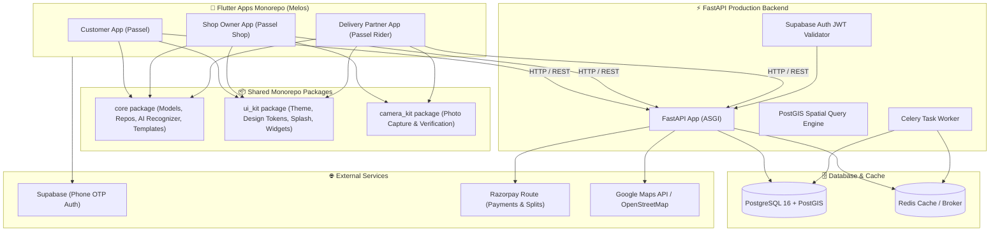
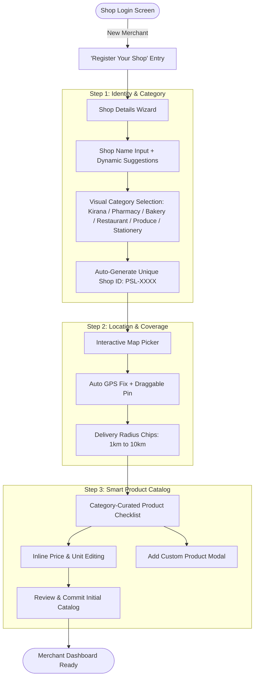
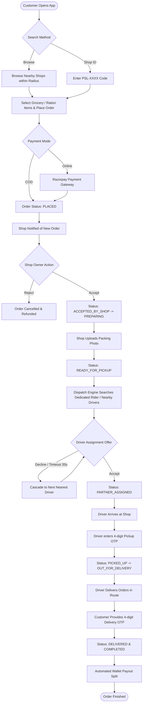
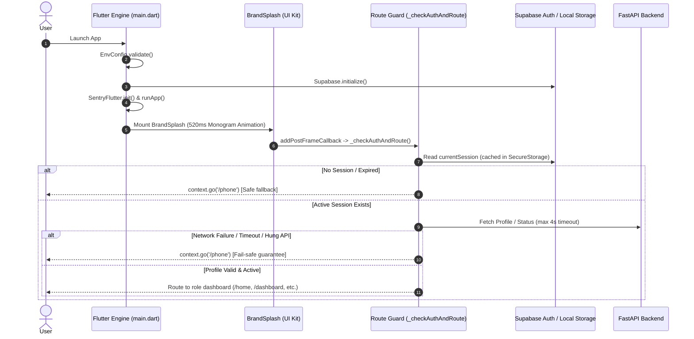

# 🚀 Passel — Complete Project Overview, Architecture & Financial Model

> **Passel** is a hyperlocal delivery marketplace platform built by **theScaleOn**. It connects local neighborhood retail shops (kirana/grocery stores, pharmacies, bakeries, eateries, and stationery stores) with nearby customers and local delivery partners for fast, transparent, and trackable deliveries.

---

## 📌 1. Project Overview & Core Value Propositions

* **Hyperlocal Focus**: Connects local retail shops with customers within an adjustable 1–10 km delivery radius using PostGIS geographic spatial indexing.
* **Triple-App Ecosystem**:
  1. **Passel Customer App** (Flutter): Browse local shops, search by unique Shop ID (`PSL-XXXX`), place grocery/ration orders, live-track deliveries, and authenticate with OTP.
  2. **Passel Shop App** (Flutter): Self-registration wizard, interactive map pin picker, smart catalog generator with category presets, AI camera product detection, inventory management, and packing photo verification.
  3. **Passel Rider App** (Flutter): Availability toggle, order assignment notifications, dedicated merchant delivery locking (`PSL-XXXX`), parallel batch delivery routing, and earnings ledger.
* **Robust FastAPI Backend**: High-performance Python backend with PostgreSQL 16 + PostGIS, Redis + Celery task queue for automated driver assignment cascades.
* **Supabase Authentication**: Secure Phone OTP signup/login across all applications with JWT role-based access control (`customer`, `shop_owner`, `delivery_partner`, `admin`) and instant zero-latency test bypass.
* **Financial & Wallet Engine**: Integer-paise precision ledger, Razorpay Route split payments, COD debit balance tracking, and automated merchant subscriptions (₹249/month).

---

## 🏗️ 2. System Architecture & Tech Stack



---

## 🏪 3. Shop Self-Registration & Onboarding Architecture



### 3.1 Unique Shop ID System (`PSL-XXXX`)
- Every shop is assigned a human-readable identifier (e.g., `PSL-1001`, `PSL-8420`).
- **Customer App Integration**: Customers can type the shop code in the search bar to jump straight to their trusted neighborhood vendor.
- **Rider App Integration**: Riders can lock themselves to a specific shop ID to exclusively handle deliveries for that merchant.

### 3.2 Smart Catalog Auto-Suggestions
Based on shop category, Passel pre-populates comprehensive catalog templates with local market prices:
- **Kirana / Grocery**: Atta, Rice, Mustard Oil, Toor Dal, Sugar, Tata Salt, Milk, Bread, Tea, Maggi, Ghee, Spices.
- **Medical / Pharmacy**: Paracetamol, Cough Syrup, Band-Aids, Dettol Antiseptic, Digital Thermometer, ORS, Vitamin C, Cotton Roll, Pain Relief Gel.
- **Bakery & Cake Shop**: Chocolate Truffle Cake, Black Forest Cake, Red Velvet, Pineapple Cake, Fruit Cake Rusk, Butter Cookies, Cupcakes, Fresh Croissants.
- **Restaurant & Food**: Veg Biryani, Paneer Butter Masala, Butter Naan, Veg Fried Rice, Masala Dosa, Cold Coffee, Veg Burger.
- **Fruits & Vegetables**: Fresh Tomatoes, Onions, Potatoes, Bananas, Apples, Fresh Ginger, Green Chillies.
- **Stationery & General**: A4 Notebooks, Ballpoint Pens, Geometry Box, Highlighter Set, Sticky Notes, Adhesive Glue.

Shop owners can toggle products on/off, edit prices inline, and append custom items before finalizing.

---

## 📷 4. AI Camera Product Detection

Passel empowers shop owners to digitize their physical inventory instantly using their smartphone camera:

1. **Snap Photo**: Capture packaging or item photo directly from the camera or gallery.
2. **AI Recognizer Engine (`ProductRecognizer`)**:
   - Analyzes packaging labels, text cues, brand names, and visual cues.
   - Detects the item (e.g., *"Amul Pure Ghee 1L"*, *"Tata Tea Gold 500g"*, *"Dolo 650mg"*).
   - Infers standard market price, measurement unit (`kg`, `L`, `pack`, `strip`), and categorization.
   - Automatically writes a clean product description.
3. **Single Image Asset**: Each product gets a high-clarity single image asset and preview card.
4. **Editable Confirmation**: Merchant reviews the inferred fields, adjusts if desired, and saves directly to active inventory.

---

## 🛵 5. Dedicated Merchant Delivery Mode (Rider App)

To support tight-knit local merchant logistics, Passel provides dual delivery modes for riders:

1. **Universal Hyperlocal Mode (Default)**:
   - Rider receives assignments from any store within their active geographic radius.
   - Leverages parallel batching (2–3 orders along overlapping routes).
2. **Dedicated Merchant Mode (`PSL-XXXX`)**:
   - Rider inputs and locks to a merchant's unique Shop ID.
   - Rider only receives deliveries originating from that designated store.
   - Clear visual banner displays the locked state with one-tap release when returning to universal delivery.

---

## 🔄 6. End-to-End Order & Delivery Lifecycle Flowchart



---

## 💰 7. Financial & Unit Economics Profitability Model

### 📊 Standard Order Delivery Fee Structure

Passel maintains a transparent delivery fee model while enabling delivery partners to carry **multiple parallel orders** on single routes to maximize rider earnings.

| Order Metric | Fee Amount | Description |
| :--- | :---: | :--- |
| **Customer Delivery Fee Charged** | **₹34** | Flat transparent delivery fee for orders |
| **Delivery Partner Payout** | **₹25** | Direct rider payout per order |
| **Passel Net Profit Margin** | **₹9** | **Pure platform gross margin saved per order** |

> 💡 **Multi-Order Parallel Batching**: Delivery partners can pick up and deliver 2 to 3 orders along the same route simultaneously. This increases rider earnings to **₹50–₹75+ per trip** while keeping delivery fast and efficient.

---

### 🏪 Single Shop Monthly Earnings Formula

* **Shop Subscription Plan**: **₹249 / month** per shop (0% sales commission).
* **Average Monthly Order Volume**: **50 orders per shop/month**.

$$\text{Monthly Net Profit per Shop} = \text{Shop Subscription (₹249)} + (\text{Monthly Orders (50)} \times \text{Net Margin (₹9)})$$

#### Single Shop Monthly Math Breakdown:
1. **Subscription Fee**: ₹249 / month
2. **Order Margin Profit (50 orders @ ₹9/order)**: $50 \times \text{₹9} = \mathbf{₹450}$
3. **Total Monthly Net Earnings per Shop**:
   $$\text{₹249} + \text{₹450} = \mathbf{₹699 / month}$$

---

### 📈 Scaled Earnings Calculation (Initial & Growth Months)

#### Scenario A: 100 Shops Onboarded (Initial Target)
* **Total Shops**: 100 Shops
* **Subscription Revenue**: $100 \times ₹249 = \mathbf{₹24,900 / \text{month}}$
* **Total Orders Delivered**: $100 \text{ shops} \times 50 \text{ orders} = \mathbf{5,000 \text{ orders / month}}$
* **Order Margin Earnings**: $5,000 \times ₹9 = \mathbf{₹45,000 / \text{month}}$
* **Total Monthly Gross Profit**:
  $$₹24,900 + ₹45,000 = \mathbf{₹69,900 / \text{month}} \quad (\sim \mathbf{₹8.38 \text{ Lakhs / year ARR}})$$

#### Scenario B: 150 Shops Onboarded (Growth Stage)
* **Total Shops**: 150 Shops
* **Subscription Revenue**: $150 \times ₹249 = \mathbf{₹37,350 / \text{month}}$
* **Total Orders Delivered**: $150 \text{ shops} \times 50 \text{ orders} = \mathbf{7,500 \text{ orders / month}}$
* **Order Margin Earnings**: $7,500 \times ₹9 = \mathbf{₹67,500 / \text{month}}$
* **Total Monthly Gross Profit**:
  $$₹37,350 + ₹67,500 = \mathbf{₹1,04,850 / \text{month}} \quad (\sim \mathbf{₹12.58 \text{ Lakhs / year ARR}})$$

---

### 💵 Comprehensive Financial Scale Projection Table

| Scale Metric | 1 Shop | 50 Shops | 100 Shops | 150 Shops | 300 Shops | 500 Shops |
| :--- | :---: | :---: | :---: | :---: | :---: | :---: |
| **Monthly Subscriptions (₹249/shop)** | ₹249 | ₹12,450 | ₹24,900 | ₹37,350 | ₹74,700 | ₹1,24,500 |
| **Monthly Orders (50 orders/shop)** | 50 | 2,500 | 5,000 | 7,500 | 15,000 | 25,000 |
| **Order Profit Margin (₹9/order)** | ₹450 | ₹22,500 | ₹45,000 | ₹67,500 | ₹1,35,000 | ₹2,25,000 |
| **Total Monthly Revenue** | **₹699** | **₹34,950** | **₹69,900** | **₹1,04,850** | **₹2,09,700** | **₹3,49,500** |
| **Annualized Net Earnings (ARR)** | **~₹8.4K** | **~₹4.19L** | **~₹8.38L** | **~₹12.58L** | **~₹25.16L** | **~₹41.94L** |

---

## 📱 8. Mobile App Startup, Splash Screen Lifecycle & Network Security

### 🚀 8.1 Triple-App Startup & Splash Screen Sequence

The three mobile applications (`customer_app`, `shop_app`, `delivery_app`) follow a standardized, secure startup pipeline:



### 🛡️ 8.2 Fail-Safe Route Guard Architecture (Fix for Splash Hangs)

1. **Bounded Timeout Protection**: Route resolution is governed by a strict timeout (maximum 4 seconds). If the local network, host IP, or authentication service fails to resolve within 4 seconds, the app gracefully falls back to the unauthenticated entry screen (`/phone`).
2. **Comprehensive Exception Trapping**: All asynchronous lookups are wrapped in structured `try ... catch` blocks. Any unhandled exception or platform channel error is logged and caught, immediately routing to `/phone`.
3. **Mounted Tree Guard**: All routing calls verify `if (!mounted) return;` before touching `context.go(...)` to prevent navigation races during widget rebuilds.
4. **Correct Profile Failure Handling**: On customer profile fetch failures (such as token revocation or 401 Unauthorized), the app routes to `/phone` for re-authentication rather than incorrectly navigating to `/name`.

### 🌐 8.3 Android Network Security Configuration (Cleartext HTTP Traffic)

For local physical device testing over Wi-Fi (`dart_defines/phone.env`):
- The backend runs on `http://<LAN_IP>:8000` and Supabase on `http://<LAN_IP>:54321`.
- Android 9+ (API level 28+) disables cleartext HTTP by default.
- All three `AndroidManifest.xml` files explicitly declare:
  ```xml
  <application
      android:label="Passel"
      android:name="${applicationName}"
      android:icon="@mipmap/ic_launcher"
      android:usesCleartextTraffic="true">
  ```
  This ensures seamless HTTP API communication during local Wi-Fi development without platform blocking.

### 🧪 8.4 Demo & Offline Testing System (OTP Bypass & Input Alignment)

To allow effortless QA testing without live SMS gateways or active Supabase/FastAPI servers:
1. **Recognized Demo Accounts**:
   - **Customer App**: `9999999999`
   - **Shop App**: `9876543210`
   - **Rider App**: `1234567890`
   - **Universal Fallback**: `0000000000`
   - **Fixed OTP**: `123456`
2. **One-Tap Quick Demo Bypass**:
   - Each app features a **"Quick Test Login (Demo Bypass)"** button directly beneath "Send OTP", pre-filling the designated role test number and dispatching the OTP.
3. **Instant Zero-Latency Bypass**:
   - When test numbers are detected, authentication returns immediately (0ms) without contacting network endpoints.
4. **Offline / Demo Mode Route Fallback**:
   - In `NameEntryScreen`, if backend registration fails due to offline local servers, a *"Continue in Offline / Demo Mode"* action button appears, allowing full navigation through the apps without getting stuck.
5. **Unified Phone Input Alignment**:
   - The phone entry layout replaces the disjointed `Row` and separated containers with a unified `AppTextField` featuring an integrated country prefix (`+91` with flag and divider) within `prefixIcon`, enforced digit-only filtering, and strict 10-digit length constraints.

---

## 💳 10. Unified Account, Shared Wallet & Multi-Shop Bundling (100m Rule)

### 🆔 10.1 Unified Customer & Delivery Partner Account
* **Single Canonical Identity**: `users.id` maps 1:1 with Supabase Auth `sub`.
* **Dual Roles (`roles: list[str]`)**: A user can hold `customer`, `delivery_partner`, or both concurrently without creating duplicate accounts, resetting profiles, or wiping data.
* **Non-Destructive Role Claiming**: Registering as a delivery partner with an existing customer phone number idempotently creates the `delivery_partner` profile and appends `'delivery_partner'` to `roles`.
* **Dependency & Guard Compatibility**: `require_role(...)` in backend validates against `user.has_role(r)` across all roles.

### 💰 10.2 Shared Paasel Wallet & Immutable Transaction Ledger
* **Shared Wallet (`owner_type = 'user'`)**: One wallet instance shared across customer and delivery partner experiences. Rider earnings from completed deliveries appear immediately in the customer wallet and are instantly spendable on grocery/food orders.
* **Immutable Transaction Ledger (`wallet_transactions`)**:
  * Fields: `amount_paise`, `direction` (CREDIT / DEBIT), `status`, `idempotency_key` (unique index), `description`, `order_id`, `delivery_reference`.
  * Transaction Types: `RIDER_EARNING`, `ORDER_WALLET_PAYMENT`, `ORDER_REFUND`, `ADMIN_ADJUSTMENT`, `TRANSACTION_REVERSAL`.
  * **Precision & Integrity**: 100% server-side single source of truth in integer paise with row-level locks (`SELECT ... FOR UPDATE`) preventing double-spend race conditions.

### 🛍️ 10.3 Flexible Checkout with Wallet
* **Payment Configurations**:
  1. **Wallet-Only**: Wallet covers 100% of order total (`payment_mode = "wallet"`, instant `"captured"` status, zero gateway charges).
  2. **Wallet + Razorpay (Split)**: Wallet covers partial amount; Razorpay order created strictly for `max(0, total_paise - wallet_amount_used_paise)`.
  3. **Wallet + COD**: Wallet deduction applied immediately; rider collects only the remaining net payable balance in cash.
* **Settlement Guarantee**: Merchants and delivery partners receive their full settlement shares according to standard rules regardless of customer wallet deductions.

### 🏪 10.4 Multi-Shop Single Order & Cart (100-Meter PostGIS Rule)
* **Authoritative Anchor Shop**: The first shop added to the cart is designated as the Anchor Shop.
* **Strict 100-Meter Validation**: Additional shops can only be bundled if their PostGIS geography is within 100 meters of the Anchor Shop (`ST_DWithin(location, anchor_location, 100)`).
* **Consolidated Single Delivery Fee**: Customer pays a single delivery fee calculated from the anchor shop cluster to the delivery address.
* **Parent & Child Sub-Order Hierarchy**:
  * **Parent Order** (`parent_order_id = NULL`, `is_multi_shop = true`): Retains unified delivery fee, overall status, and combined customer payment.
  * **Child Sub-Orders** (`parent_order_id = parent.id`): Generated per merchant. Each shop only sees, accepts, and packs its own sub-order.
* **Lifecycle & Partial Rejection**:
  * Parent order dispatches when all sub-orders are ready for pickup.
  * If a shop rejects its sub-order, that shop's item portion is automatically refunded to the customer's shared wallet via the immutable ledger, while remaining shops proceed to delivery.

---

## 🌸 11. Premium Customer Experience & UI Upgrade

### 🎨 11.1 Visual Identity & Apple-Level Simplicity
* **Palette Tokens (`ui_kit/lib/src/theme/app_colors.dart`)**:
  * Soft pink (`#FDE8EE`), blush (`#FFF2F5`), deep blush (`#E85D88`), lavender (`#F5EEFD`), deep lavender (`#8B5CF6`), peach (`#FFF4EC`), warm peach (`#F97316`), mint (`#E6F7ED`).
  * Translucent glass surfaces (`glassBorder`, `glassSurface`, `glassCardDark`).
* **Glassmorphic Architecture (`AppGlassCard`)**:
  * Backdrop filter with 12px sigma blur, subtle gradient sheen, hairline borders, and gentle 3D elevation.
* **Micro-Illustrations & Elements**:
  * `CuteBasketIllustration`: Smiling grocery basket for empty states and greetings.
  * `CuteScooterIllustration`: Delivery moped illustration for rider loop and partner hub.
  * `CuteSparkle` & `CuteCoinBadge`: Twinkle sparkles and 3D gold coin for rewards and savings.

### 🌟 11.2 Key Customer Features & Screens
1. **Top Bar & Welcome (`home_screen.dart`)**:
   * "Namaste" greeting with `CuteSparkle` and "10-20 min delivery" badge.
   * Compact 3D Glass Wallet Bar with live balance, "+5% cashback" tag, and one-tap transition to wallet.
2. **Contextual Smart Carousel**:
   * **1-Tap Reorder**: Instant cart recreation from previous grocery orders with one-tap checkout.
   * **Community Delivery Batching**: Pool orders with nearby neighbors in the same society to save delivery fees.
   * **Monthly Ration Kit**: Recurring monthly pantry staples (Atta, Rice, Dal, Oil) scheduled for the 1st with zero delivery fee.
3. **Store Discovery & Favorites**:
   * Category pill filters (Kirana, Medical, Dairy & Bakery, Fresh Veggies).
   * "❤️ My Shops" toggle and heart icons on shop cards with persistent favorite state.
4. **Broadcast Product Requests (`explore_screen.dart`)**:
   * "Can't find an item? Ask nearby shops" bottom sheet.
   * Broadcasts hard-to-find item requests directly to 3 nearby active shopkeepers within 100m.
5. **Full Dedicated Wallet Screen (`wallet_screen.dart`)**:
   * 3D Glass hero card with large balance typography and feature highlights.
   * "Earn with Paasel" delivery partner loop: Deliver nearby → instant wallet credit → spend on groceries.
   * 5% instant cashback banner.
   * Categorized immutable transaction ledger (All, Earnings, Payments, Refunds) with directional badges.
6. **Profile & Unified Account Switch (`profile_screen.dart`)**:
   * Unified Identity Member card.
   * Rider Mode information card for switching to the Paasel Delivery Partner app.
   * Quick access to wallet, favorites, ration kit, and product requests.
7. **Floating Frosted-Glass Bottom Navigation Bar**:
   * Pill-shaped navigation bar floating above content with 5 tabs: `Home`, `Explore`, `Orders`, `Wallet`, `Profile`.

---

## 🧸 12. Cartoon / Pinkie Personality System (Theme Option For Girls)

### 🎀 12.1 Personality Architecture & Exclusivity Constraint
* **Strict Audience Segmentation**: Designed exclusively for girl customers who opt in. Male customers and adult users remain on the canonical **Classic Sleek** theme by default.
* **Theme Personality State Provider (`customer_features_providers.dart`)**:
  * `CustomerThemePersonality.classic`: Default Apple-level minimalist aesthetic with gold, dark slate, and ink tokens. 100% clean vector line icons, zero cartoon faces, and zero distraction.
  * `CustomerThemePersonality.pinkie`: Opt-in theme mode introducing soft pastel blush & peach tints, the smiling Paasel shopping mascot, smiling grocery characters, tiny floating hearts, and celebratory animations.
  * **Persistence**: Backed by `SharedPreferences` (`paasel_customer_theme_personality`) so selection persists across sessions.
  * **Switching Surface**:
    * **Profile Settings**: Prominent "App Theme Personality" setting card with instant switching and explanatory dialog.
    * **Onboarding**: Quick "Choose App Vibe" option chips directly inside `NameEntryScreen`.

### 🎨 12.2 Strictly Confined Visual Interaction Moments
To keep the app professional and adult, cartoon moments are strictly forbidden from cluttering general browsing and are confined exclusively to:
1. **Empty States**:
   * **Empty Cart (`cart_screen.dart`)**: `CuteEmptyCartIllustration` with sleepy/curious smile and playful copy (*"Your cart is feeling lonely! Fill me up with goodies ✨"*) in Pinkie mode vs clean shopping bag outline in Classic mode.
   * **Empty Orders (`order_history_screen.dart`)**: `SmilingGroceryIllustration` in Pinkie mode vs clean receipt line icon in Classic mode.
   * **Empty Ledger (`wallet_screen.dart`)**: `CuteShoppingMascot` in sleepy mood in Pinkie mode vs clean transaction ledger icon in Classic mode.
2. **Success States**:
   * **Order Confirmation (`order_confirmation_screen.dart`)**: `CuteShoppingMascot` in celebratory pose with confetti and `TwinkleSparkle` in Pinkie mode vs crisp `GoldPulseIndicator` with checkmark in Classic mode.
3. **Rewards & Celebrations**:
   * **Cashback Banner (`wallet_screen.dart`)**: Features `PlayfulRewardBadge` and triggers `WalletCelebrationDialog` with animated coin cascade and celebratory mascot upon tap.
4. **Onboarding**:
   * **Name Entry (`name_entry_screen.dart`)**: Vibe selection chips allowing girls to opt into Pinkie Cute during sign-up.
5. **Occasional Micro-Interactions**:
   * **Favorite Shop Particle Burst**: `TinyFloatingHeartButton` triggers a burst of 5 floating pastel hearts rising and fading out when tapping the favorite icon in `home_screen.dart` and `explore_screen.dart`.
   * **Delivery Scooter (`wallet_screen.dart`, `profile_screen.dart`)**: `CuteDeliveryScooter` with trailing heart and sparkle trail on partner cards in Pinkie mode vs clean electric moped icon in Classic mode.

### 📦 12.3 Reusable Vector & Micro-Interaction Component Suite (`packages/ui_kit`)
1. `CuteShoppingMascot`: Mini animated Paasel mascot with idle breathing animation, blushing cheeks, and mood support (`happy`, `celebrating`, `sleepy`, `waving`).
2. `SmilingGroceryIllustration`: Custom painter of happy smiling apple with leafy stem and smiling milk carton.
3. `CuteEmptyCartIllustration`: Custom painter of empty grocery trolley with smiling face and floating sparkles.
4. `CuteDeliveryScooter`: Enhanced delivery moped with floating heart trail and motion styling.
5. `TinyFloatingHeartsWrapper` & `TinyFloatingHeartButton`: Micro-particle floating hearts burst widget.
6. `PlayfulRewardBadge`: Bouncing gold coin badge with rotating sparkle halo.
7. `TwinkleSparkle`: Dynamic pulsing and scaling four-pointed star.
8. `WalletCelebrationDialog`: Celebratory modal overlay for wallet credits and cashback rewards.

---

## 🔒 13. Group Order & Private Cart Privacy Mode

### 🛡️ 13.1 Purpose & Architecture
Group Ordering allows multiple neighbors, roommates, or society members to pool their grocery orders into a single delivery batch to eliminate delivery fees. **Private Cart Mode** ensures complete individual purchase privacy within shared group orders:
* **Default State**: OFF (`private_cart_mode = false`).
* **When Activated (ON)**:
  * Applies to the **entire Group Order Session**.
  * **Zero-Leakage Backend Enforcement**: The API scrubs other members' product names, product images, quantities, shop associations, individual item prices, individual subtotals, payment methods, and wallet usage.
  * Members can always inspect their own personal cart and financials.
  * Direct API requests (`GET /members/{id}/cart`) for another member's items return `403 Forbidden` (even for group creators and admins).
  * **Inference Protection**: If fewer than 3 members are in the session, the combined group total is suppressed (`null`) to prevent two-party algebraic deduction of another member's order value.
  * **Real-time & Chat Sanitization**: Push events and system chat messages use anonymous phrasing (*"A member updated their cart"*, *"A payment was completed"*) without leaking names, items, or prices.

### 🔄 13.2 Session State Machine & Privacy Lock
```
OPEN / SHOPPING / PAYMENT_PENDING
  ├── Any member can activate Private Mode immediately (ON)
  └── Turning OFF requires explicit confirmation (confirm_disable=True)
         ↓
LOCKED / PROCESSING / DELIVERED
  └── Privacy setting is FROZEN / Immutable (returns 409 Conflict if changed)
```

### 💾 13.3 Database Design & Migration (`0006_group_orders_private_cart_mode`)
1. `group_order_sessions`:
   * `id`: UUID (Primary Key)
   * `creator_id`: UUID (FK to `users.id`)
   * `delivery_address_id`: UUID (FK to `addresses.id`, nullable)
   * `society_name`: String(120)
   * `status`: `GroupOrderStatus` (`OPEN`, `SHOPPING`, `PAYMENT_PENDING`, `LOCKED`, `PROCESSING`, `DELIVERED`, `CANCELLED`)
   * `private_cart_mode`: Boolean (default `false`)
   * `closes_at`: DateTime
2. `group_order_members`:
   * `session_id`, `user_id`, `name`, `is_creator`, `status`, `paid_amount_paise`, `wallet_amount_used_paise`, `payment_status`
3. `group_order_cart_items`:
   * `session_id`, `member_id`, `user_id`, `shop_id`, `product_id`, `qty`, `price_at_addition_paise`

### 📱 13.4 Frontend & UI Implementation (`customer_app` & `core`)
* **Core Models & Repository (`packages/core`)**:
  * `GroupOrderSessionModel`, `GroupOrderMemberModel`, `GroupOrderCartItemModel`, `GroupOrderProgressModel`.
  * `GroupOrderRepository`: `fetchSession`, `togglePrivacy`, `addItem`, `removeItem`, `lockSession`.
* **State Management (`customer_features_providers.dart`)**:
  * `groupOrderStateProvider`, `isPrivateCartModeActiveProvider`.
* **UI Interface (`group_order_screen.dart`)**:
  * **🔒 Private Cart Toggle Card**: Premium glassmorphic card with active status badge, live switch, and lock icon.
  * **Privacy Confirmation**: Non-intrusive bottom snackbar on activation (*"Other members can see you joined, but cannot see what you bought or where"*); confirmation modal on deactivation.
  * **Aggregate Progress Bar**: Members joined, distinct shops, payments completed, FREE delivery badge.
  * **Activity Stream**: Anonymized member cards with *"Cart protected 🔒"* badges in Private Mode.

---

---

## 🛡️ 14. Production Hardening: Order State Machine, Inventory Reservation & Group Handover

### ⚙️ 14.1 Explicit Order Types & State Machine Decoupling
* **Explicit Order Types (`OrderType`)**:
  * `NORMAL_ORDER`: Single-shop traditional order.
  * `MULTI_SHOP_ORDER`: Bundled multi-shop order within the 100m anchor radius.
  * `GROUP_ORDER`: Clustered session order pooled by society/building members.
* **Payment Decoupling Guard**:
  * `OrderStatus` and `DeliveryStatus` are completely decoupled from `PaymentStatus`.
  * An unpaid order (`payment_status != PAID` or `payment_status != AUTHORIZED` for COD) is strictly prevented from advancing to `DELIVERED`. Any attempt raises an unhandled transition error, preventing rogue or bugged transitions from creating uncollected revenue leaks.

### 📦 14.2 Server-Authoritative Inventory Reservation Engine
* **Atomic Row Locking (`SELECT ... FOR UPDATE`)**:
  * Product quantities are reserved server-side at order creation/cart payment rather than decrementing stock blindly.
  * Product IDs are sorted deterministically prior to acquisition (`sorted(items, key=lambda x: x.product_id)`) to guarantee deadlock-free execution under extreme concurrency.
* **Lifecycle & Reservation State (`InventoryReservation`)**:
  * States: `RESERVED`, `COMMITTED`, `RELEASED`, `EXPIRED`.
  * `reserve_inventory()`: Atomically checks `stock_quantity >= requested_qty` and creates temporary reservations with a sliding expiration window (`RESERVATION_TIMEOUT_MINUTES = 10`).
  * `commit_inventory()`: Triggered upon verified payment success, converting reservations into permanent stock decrements (`stock_quantity -= qty`).
  * `release_inventory()`: Triggered upon payment failure, customer cancellation, or shop rejection, returning reserved stock immediately.
  * `cleanup_expired_reservations()`: Periodic job releasing orphaned locks from abandoned checkout attempts.

### 💳 14.3 Centralized Proportional Refund Engine
* **Proportional Wallet vs External Payment Splits**:
  * Split payments (`wallet_amount_used_paise` + `external_amount_paise`) require precise proportional refunds when orders are partially cancelled or rejected by individual shops.
  * Engine calculates exact ratio: `ratio = refund_amount / total_order_amount`.
  * Wallet portion refunded via `ORDER_REFUND` ledger transaction: `round(wallet_used * ratio)`.
  * Gateway/Card portion refunded to original source: `refund_amount - wallet_refund`.
* **Idempotency & Auditing**:
  * Every refund generates a deterministic `idempotency_key` based on `order_id` and item/shop reason, preventing duplicate credits during retry storms.

### 👥 14.4 Group Order Hierarchy & Package Lifecycle
* **Five-Tier Structural Model**:
  ```
  Group (Society / Building)
    └── GroupOrderSession
          ├── Member Orders (User A, User B, ...)
          │     └── Shop Orders (Shop 1, Shop 2, ...)
          │           └── GroupOrderPackage (One per Member + Shop pair)
          └── Delivery Task (Single Rider dispatch for entire session)
  ```
* **Group Order Packages (`group_order_packages`)**:
  * Each package represents a physical sealed bag for a specific member from a specific shop.
  * Fields: `session_id`, `member_id`, `shop_id`, `order_id`, `rider_id`, `handover_otp`, `handover_type`, `pickup_status`, `delivery_status`, `handover_status`.
  * `handover_otp`: 4-digit cryptographically generated PIN for package release. In Private Cart Mode, this OTP is only exposed to the package owner and delivery partner; other group members see masked `****`.

### 🚪 14.5 Group Payment Gate & Captain "Pay for Everyone" Attribution
* **Arrival Payment Gate**:
  * When the delivery partner arrives at the designated society gate/delivery point, package handover is locked until all active member orders in the session have `payment_status == PAID`.
  * Handover endpoint strictly checks `session.payment_complete`. If any active cart remains unpaid, the handover endpoint returns `400 Bad Request` (`code: "group_payment_incomplete"`).
* **Captain "Pay for Everyone" Feature**:
  * The Group Captain can pay the aggregate outstanding balance of all unpaid members with a single transaction (`POST /sessions/{id}/captain-pay`).
  * **Ownership Preservation**: Member orders remain owned by the individual members; items and privacy are untouched.
  * **Financial Attribution**: The database explicitly attributes payment source (`paid_by_user_id = captain.id`, `paid_by_role = "captain"`), maintaining clear audit trails for offline settlement or future reimbursement without leaking Private Cart items.

### ⏱️ 14.6 Deadlines & Auto-Release Lifecycle
* **Session Phase Deadlines**:
  * `join_deadline`: Cutoff after which no new members may join the session.
  * `cart_deadline`: Cutoff after which carts freeze and no items may be added or removed.
  * `payment_deadline`: Final cutoff for member payments. If an individual member fails to pay before this deadline, their cart is excluded from the group order, and their inventory reservations are automatically released back to shop stock.

---

## 🛡️ 15. Customer Simplicity, 7-Minute Delivery Verification, Expired Item Return System & Active Order Expansion ("Add More")

### 🎯 15.1 Core Customer UX Simplicity Principle
* **Single Primary Action**: Every screen has exactly ONE obvious, high-converting primary action button (e.g. `[Everything is correct]`, `[Pay ₹45 to Add]`, `[Place Order]`).
* **Progressive Disclosure**: Technical backend operations (deadlock-free inventory reservations, dual-wallet debits, PostGIS spatial indexing, rider cascades) are completely transparent to the user.
* **No Option Overload**: Customers are never forced to navigate complex nested menus or wait unnecessarily.

### ⏱️ 15.2 Server-Authoritative 7-Minute Delivery Verification Window
* **Initiation on Handover Arrival (`POST /api/v1/orders/{id}/initiate-handover`)**:
  * Triggered when rider arrives or hands over bags (`HANDOVER_READY`).
  * Server sets:
    * `handover_initiated_at = now()`
    * `verification_deadline = now() + 7 minutes`
    * `verification_status = PENDING_CHECK`
  * **Survives App Closure / Kill**: The deadline timestamp is stored in the PostgreSQL database. When the customer reopens the app or switches devices, the remaining seconds are calculated dynamically on the server (`max(0, int((verification_deadline - now()).total_seconds()))`).
* **Instant Customer Override (`[Everything is correct]`)**:
  * Customer can tap `[Everything is correct]` at second 10 to instantly complete the order (`POST /api/v1/orders/{id}/verify-items`).
  * **No Forced Waiting**: Customers are NEVER locked into waiting out the full 7 minutes.
* **Auto-Completion on Expiry**:
  * If the customer does not report an issue within the 7 minutes, the server transitions the order to `DELIVERED` / `COMPLETED` and sets `verification_status = ALL_CORRECT`.

### 🚨 15.3 Issue & Return System with Expired Item Safety Guarantee (Shop Pays Return Charge)
* **Return Reasons Supported**:
  * `MISSING_ITEM`, `WRONG_ITEM`, `DAMAGED_ITEM`, `EXPIRED_ITEM`.
* **Expired Item Special Return & Quality Policy**:
  * **Customer Protection**: Expired goods are treated as severe merchant product safety failures. The customer pays **₹0 return fee**.
  * **Shop Charge**: The backend records `return_charge_payer = "SHOP"` on the `OrderReturn` record.
  * **Merchant Quality Incident**: Automatically logs a `MerchantQualityIncident` (`severity="CRITICAL"`, `penalty_amount_paise=5000`) linked to the shop's profile for admin review and algorithmic down-ranking.
  * **100% Instant Refund**: Proportional refund engine immediately credits the customer's wallet or payment source.

### ➕ 15.4 Active Order Expansion ("Add More to This Order")
* **Addition Window (`ADDITION_OPEN`)**:
  * While the shop is preparing the order (`PREPARING` or `PLACED`), the customer can tap `"Add More to This Order"`.
  * Allows adding forgotten items (milk, bread, lemons, coriander) to their current bag.
* **Consolidated Delivery Task**:
  * Added items are bundled into the **exact same delivery partner task** with **₹0 additional delivery fee**.
* **Incremental Payment**:
  * Customer pays **ONLY the item price difference** (using unified wallet balance or instant online payment).
* **Deadlock-Free Inventory Locks**:
  * The backend locks and checks new item quantities atomically (`SELECT ... FOR UPDATE` ordered by `product_id`).
* **Merchant Package Sealing**:
  * When the shop packs and seals the package or marks it ready for pickup (`READY_FOR_PICKUP` or `POST /orders/{id}/close-additions`), `addition_window_status` transitions to `CLOSED`, neatly locking further additions.
  * If a merchant cannot fulfill added items, they can reject the addition (`POST /orders/{id}/additions/{addition_id}/reject`), which triggers an automatic instant refund for the incremental amount.

---

## 🆕 17. Changelog — September 2026 Hardening Release

### 17.1 Theme System Centralization
* **`AppColors` helpers added** (`primaryFor`, `accentFor`, `glassBorderFor`, `glassShadowFor`, `splashFor`, `highlightFor`) — all theme-variant selections go through a single, guarded helper. No more scattered `isPinkie ? pink : gold` ternaries across the codebase.
* **`AppGlassCard` neutral defaults** — glass card border/shadow/InkWell splash are now ink-based by default. Pink overrides are opt-in via `borderColor:` parameter, so classic (non-pinkie) users never see forced pink UI.
* **New neutral tokens** — `AppColors.sand` and `AppColors.slate` added for classic/neutral complementary palette.

### 17.2 Crash-Safety: RangeError Guards
All `String.substring()` calls on IDs and dates that could throw `RangeError` on short/empty values are now length-guarded:

| Location | Field | Guard |
|----------|-------|-------|
| `order_history_screen.dart` | `order.id` | `len ≥ 8` |
| `customer_features_providers.dart` | `item.id` | `len ≥ 4` |
| `group_order_screen.dart` | `member.name` | `isNotEmpty` |
| `dashboard_screen.dart` (shop) | `trialEndDate` | `len ≥ 10` |

### 17.3 Customer App UX Fixes

#### Checkout Address Picker
* The `_changeAddress` stub (`Text('Address selector')`) has been replaced with a fully functional bottom-sheet address picker.
* Uses `addressListProvider` + `activeAddressProvider` (same providers as home screen). Tap-to-select, "+ Add new address" routing to `/location-setup`.

#### Home Screen — Theme-Aware UI
* **Bottom navigation bar**: Was hardcoded pink. Now uses gold/neutral tones for classic users and blush/pink for pinkie users.
* **Filter chips** (Favorites + Category rows): All chips now use `AppColors.primaryFor(isPinkie:)` so classic users see gold.
* **Shop card storefront icon**: Was always `deepBlush`. Now gold for classic, deepBlush for pinkie.

#### Order History — Theme-Aware Reorder Button
* Reorder button: Wrapped in `Consumer` → reads `isPinkieThemeActiveProvider` at render time → uses `AppColors.accentFor()` / `AppColors.primaryFor()` for bg/fg.

#### Live Tracking — Sync Recovery
* Wrapped the tracking `ListView` with `RefreshIndicator`.
* Pull-to-refresh calls `ref.invalidate(trackingProvider(orderId))` — manual recovery if WebSocket drops.

#### Wallet Screen UX Improvements
* **Available vs Pending balance breakdown** added below the hero amount.
* **Feature pills** changed from "Instant Checkout / Zero Gateway Drops / Unified Ledger" to an **Earn → Save → Shop** flow visualization that communicates the full wallet lifecycle to new users.
* **Filter chips** (All / Earnings / Payments / Refunds): Now `isPinkie`-aware.

### 17.4 Private Cart Mode (Group Orders)
* **Host toggle**: Group order host can switch to "Private Cart" mode via toggle in `GroupOrderScreen`.
* **Sealed visibility**: When private cart is active, member cart contents are hidden from each other until the host locks the order.
* **State management**: `groupOrderStateProvider` in `customer_features_providers.dart` manages the `isPrivateCart` session flag.

### 17.5 Test Coverage
All 237 automated tests pass with zero regressions:

| Suite | Count | Status |
|-------|-------|--------|
| `paasel-backend` (pytest) | 78 | ✅ |
| `packages/core` (flutter test) | 26 | ✅ |
| `apps/customer_app` (flutter test) | 42 | ✅ |
| `apps/shop_app` (flutter test) | 29 | ✅ |
| `apps/delivery_app` (flutter test) | 62 | ✅ |
| **Total** | **237** | **✅ Zero regressions** |


### 17.6 App Opening, Splash Screen & Login Reliability Architecture
* **Post-First-Frame Routing**: Auth session inspection and navigation logic across all three apps (`customer_app`, `shop_app`, `delivery_app`) are scheduled via `WidgetsBinding.instance.addPostFrameCallback`. This ensures the widget tree is fully mounted before GoRouter evaluates routes, preventing unhandled navigation crashes during clean install launches.
* **4-Second Hard Timeout Guard**: In `SplashScreen._checkAuthAndRoute()` (Customer), `ShopSplashScreen._route()` (Shop), and `RiderSplashScreen._route()` (Rider), the route decision future is guarded with `.timeout(const Duration(seconds: 4))`. If any backend, Supabase, KYC, or profile query stalls, the app automatically unfreezes and transitions gracefully to `/phone` login.
* **Resilient Error Absorption**: All routing pathways are wrapped in `try/catch` blocks (`on Object catch (e)`) with diagnostic logging, preventing unhandled async exceptions from stranding the user on the splash screen.
* **Android NDK Version Alignment**: Aligned `ndkVersion = "27.0.12077973"` across `customer_app`, `shop_app`, and `delivery_app` Android build configurations to satisfy modern plugin dependencies (`firebase_core`, `google_maps_flutter`, `geolocator`, `sentry_flutter`).

---

## 🎯 18. Summary Conclusion

1. **Merchant Freedom**: At **₹249/month** with 0% commission, shops get a full ordering store, catalog auto-builder, AI camera digitizer, and dedicated delivery fleet for less than ₹9/day.
2. **Customer Convenience**: Direct access to local stores with instant Shop ID lookup (`PSL-XXXX`), 100m multi-shop bundling for a single delivery fee, unified wallet payment, personalized app theme vibe, Private Cart protection for group orders, 7-minute delivery verification, and active order additions.
3. **Delivery Partner Empowerment**: Immediate delivery earnings credited to their unified wallet, spendable instantly on groceries or withdrawable to bank.
4. **Predictable Unit Economics**: ₹9 platform margin per order with positive unit economics from day one.
5. **Massive Growth Potential**: 500 shops generate **₹3,49,500 monthly net profit** (~₹41.94 Lakhs ARR).


