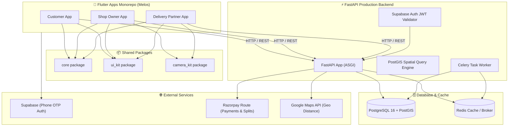
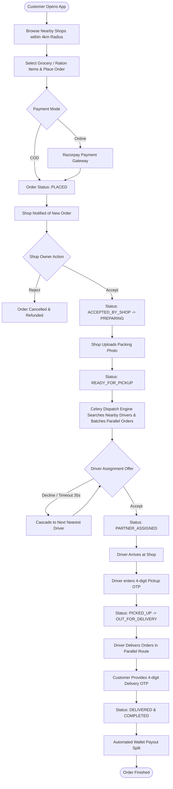
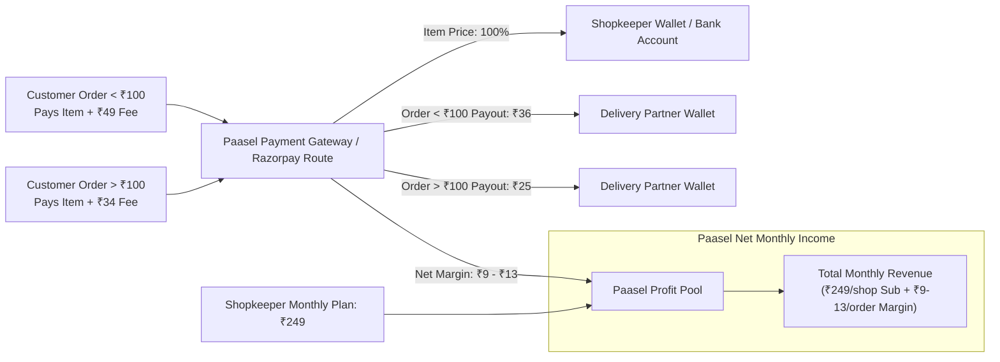

# 🚀 Paasel — Complete Project Overview, Architecture & Financial Model

> **Paasel** is a hyperlocal delivery marketplace application built by **theScaleOn**. It connects local neighborhood retail shops (kirana/grocery stores) with nearby regular customers and local delivery partners for fast, seamless, and trackable delivery.

---

## 📌 1. Project Overview (In Short Points)

* **Hyperlocal Focus**: Connects local retail shops with customers within a 4 km delivery radius using PostGIS geographic spatial indexing.
* **Triple-App Ecosystem**:
  1. **Customer App** (Flutter): Browse local catalog, place recurring ration/grocery orders, live track delivery, OTP verification.
  2. **Shop Owner App** (Flutter): Inventory/product management, order acceptance, packing photo verification, subscription status tracking.
  3. **Delivery Partner App** (Flutter): Order assignment notification (Fresh & Batch detour), parallel multi-order delivery routing, pickup/delivery OTP validation, wallet earnings.
* **Robust FastAPI Backend**: High-performance Python backend with PostgreSQL 16 + PostGIS, Redis + Celery task queue for automated driver assignment cascades.
* **Supabase Authentication**: Secure Phone OTP signup/login across all applications with JWT role-based access control (`customer`, `shop_owner`, `delivery_partner`, `admin`).
* **Financial & Wallet Engine**: Integer-paise precision ledger, Razorpay Route split payments, COD debit balance tracking, and automated merchant subscriptions (₹249/month).

---

## 🏗️ 2. System Architecture & Tech Stack

---

## 🔄 3. End-to-End Order & Delivery Lifecycle Flowchart

---

## 💰 4. Financial & Unit Economics Profitability Model

### 📊 Tiered Delivery Fee Structure

Paasel operates a tiered delivery fee structure based on customer order value, while enabling delivery partners to carry **multiple parallel orders** on single routes to maximize rider earnings.

| Order Value Tier | Delivery Fee Charged | Delivery Partner Payout | Paasel Net Profit Margin |
| :--- | :---: | :---: | :---: |
| **Below ₹100 Order** | **₹49** | **₹36** | **₹13** |
| **Above ₹100 Order** | **₹34** | **₹25** | **₹9** |

> 💡 **Multi-Order Parallel Batching**: Delivery partners can pick up and deliver 2 to 3 orders along the same route simultaneously. This increases rider earnings to **₹50–₹100+ per trip** while keeping delivery fast and efficient.

---

### 🏪 Single Shop Monthly Earnings Formula

* **Shop Subscription Plan**: **₹249 / month** per shop (0% sales commission).
* **Average Monthly Order Volume**: **50 orders per shop/month**.

$$\text{Monthly Net Profit per Shop} = \text{Shop Subscription (₹249)} + (\text{Monthly Orders (50)} \times \text{Net Margin per Order})$$

#### Single Shop Monthly Math Breakdown:
1. **Subscription Fee**: ₹249 / month
2. **Order Margin Profit (50 orders)**:
   * Min Margin (Above ₹100 orders @ ₹9/order): $50 \times \text{₹9} = \mathbf{₹450}$
   * Average Margin (Weighted blend @ ₹11/order): $50 \times \text{₹11} = \mathbf{₹550}$
   * Max Margin (Below ₹100 orders @ ₹13/order): $50 \times \text{₹13} = \mathbf{₹650}$
3. **Total Monthly Net Earnings per Shop**:
   $$\text{Min: } ₹249 + ₹450 = \mathbf{₹699/month}$$
   $$\text{Avg: } ₹249 + ₹550 = \mathbf{₹799/month}$$
   $$\text{Max: } ₹249 + ₹650 = \mathbf{₹899/month}$$

---

### 📈 Scaled Earnings Calculation (Initial & Growth Months)

#### Scenario A: 100 Shops Onboarded (Initial Target)
* **Total Shops**: 100 Shops
* **Subscription Revenue**: $100 \times ₹249 = \mathbf{₹24,900 / \text{month}}$
* **Total Orders Delivered**: $100 \text{ shops} \times 50 \text{ orders} = \mathbf{5,000 \text{ orders / month}}$
* **Order Margin Earnings**:
  * Min (@ ₹9/order): $5,000 \times ₹9 = \mathbf{₹45,000}$
  * Avg (@ ₹11/order): $5,000 \times ₹11 = \mathbf{₹55,000}$
  * Max (@ ₹13/order): $5,000 \times ₹13 = \mathbf{₹65,000}$
* **Total Monthly Gross Profit**:
  * **Min**: $₹24,900 + ₹45,000 = \mathbf{₹69,900 / \text{month}}$ (~₹8.38 Lakhs / year)
  * **Avg**: $₹24,900 + ₹55,000 = \mathbf{₹79,900 / \text{month}}$ (~₹9.58 Lakhs / year)
  * **Max**: $₹24,900 + ₹65,000 = \mathbf{₹89,900 / \text{month}}$ (~₹10.78 Lakhs / year)

---

#### Scenario B: 150 Shops Onboarded (Growth Stage)
* **Total Shops**: 150 Shops
* **Subscription Revenue**: $150 \times ₹249 = \mathbf{₹37,350 / \text{month}}$
* **Total Orders Delivered**: $150 \text{ shops} \times 50 \text{ orders} = \mathbf{7,500 \text{ orders / month}}$
* **Order Margin Earnings**:
  * Min (@ ₹9/order): $7,500 \times ₹9 = \mathbf{₹67,500}$
  * Avg (@ ₹11/order): $7,500 \times ₹11 = \mathbf{₹82,500}$
  * Max (@ ₹13/order): $7,500 \times ₹13 = \mathbf{₹97,500}$
* **Total Monthly Gross Profit**:
  * **Min**: $₹37,350 + ₹67,500 = \mathbf{₹1,04,850 / \text{month}}$ (~₹12.58 Lakhs / year)
  * **Avg**: $₹37,350 + ₹82,500 = \mathbf{₹1,19,850 / \text{month}}$ (~₹14.38 Lakhs / year)
  * **Max**: $₹37,350 + ₹97,500 = \mathbf{₹1,34,850 / \text{month}}$ (~₹16.18 Lakhs / year)

---

### 💵 Comprehensive Financial Scale Projection Table

| Scale Metric | 1 Shop | 50 Shops | 100 Shops | 150 Shops | 300 Shops | 500 Shops |
| :--- | :---: | :---: | :---: | :---: | :---: | :---: |
| **Monthly Subscriptions (₹249/shop)** | ₹249 | ₹12,450 | ₹24,900 | ₹37,350 | ₹74,700 | ₹1,24,500 |
| **Monthly Orders (50 orders/shop)** | 50 | 2,500 | 5,000 | 7,500 | 15,000 | 25,000 |
| **Order Profit Margin (₹9 - ₹13)** | ₹450 - ₹650 | ₹22,500 - ₹32,500 | ₹45,000 - ₹65,000 | ₹67,500 - ₹97,500 | ₹1,35,000 - ₹1,95,000 | ₹2,25,000 - ₹3,25,000 |
| **Total Monthly Revenue** | **₹699 - ₹899** | **₹34,950 - ₹44,950** | **₹69,900 - ₹89,900** | **₹1,04,850 - ₹1,34,850** | **₹2,09,700 - ₹2,69,700** | **₹3,49,500 - ₹4,49,500** |
| **Annualized Net Earnings (ARR)** | **~₹8.4K - ₹10.8K** | **~₹4.19L - ₹5.39L** | **~₹8.38L - ₹10.78L** | **~₹12.58L - ₹16.18L** | **~₹25.16L - ₹32.36L** | **~₹41.94L - ₹53.94L** |

---

### 💳 Financial Revenue Flow & Cash Distribution Diagram

---

## 🎯 Summary Conclusion

1. **Increased Merchant Value**: At **₹249/month**, shops get a complete digital store, ordering app, and delivery fleet for under ₹9/day.
2. **Highly Efficient Rider Batching**: Allowing riders to carry **multiple orders in parallel** significantly increases rider retention and hourly payout.
3. **Solid Profitability Milestone**:
   * **100 Shops** generates **₹69,900 to ₹89,900 / month** (~₹10.7 Lakhs ARR).
   * **150 Shops** generates **₹1,04,850 to ₹1,34,850 / month** (~₹16.1 Lakhs ARR).
4. **Strong Scaling Potential**: Reaching **500 shops** generates over **₹3.5 Lakhs to ₹4.5 Lakhs monthly net profit** (~₹50+ Lakhs ARR).
