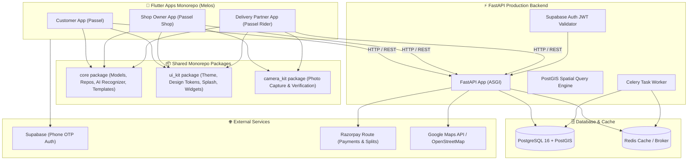
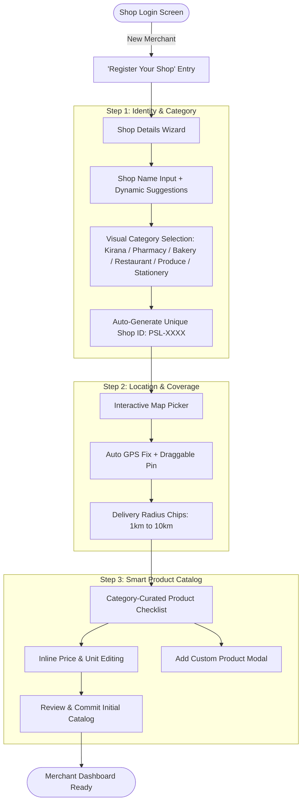
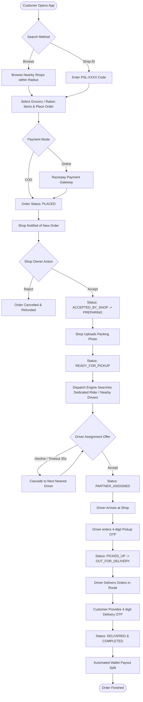
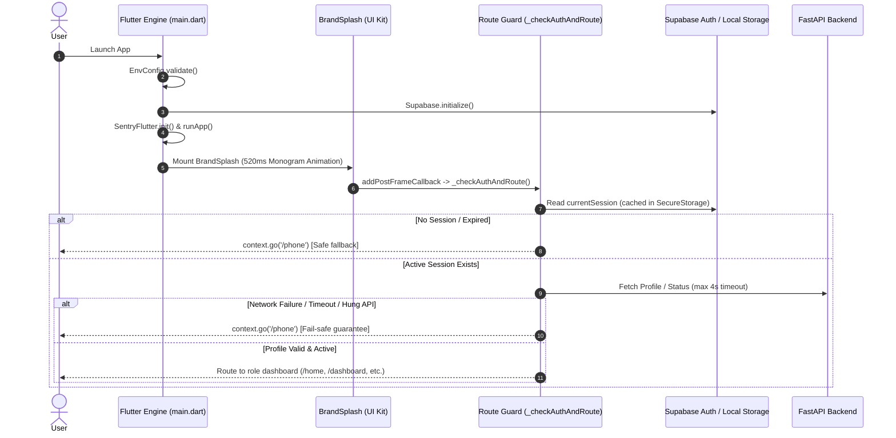

# 🚀 Passel — Complete Project Overview, Architecture & Financial Model

> **Passel** is a hyperlocal delivery marketplace platform built by **theScaleOn**. It connects local neighborhood retail shops (kirana/grocery stores, pharmacies, bakeries, eateries, and stationery stores) with nearby customers and local delivery partners for fast, transparent, and trackable deliveries.

---

## 📌 1. Project Overview & Core Value Propositions

* **Hyperlocal Focus**: Connects local retail shops with customers within an adjustable 1–10 km delivery radius using PostGIS geographic spatial indexing.
* **Triple-App Ecosystem**:
  1. **Passel Customer App** (Flutter): Browse local shops, search by unique Shop ID (`PSL-XXXX`), place grocery/ration orders, live-track deliveries, and authenticate with OTP.
  2. **Passel Shop App** (Flutter): Self-registration wizard, interactive map pin picker, smart catalog generator with category presets, AI camera product detection, inventory management, and packing photo verification.
  3. **Passel Rider App** (Flutter): Availability toggle, order assignment notifications, dedicated merchant delivery locking (`PSL-XXXX`), parallel batch delivery routing, and earnings ledger.
* **Robust FastAPI Backend**: High-performance Python backend with PostgreSQL 16 + PostGIS, Redis + Celery task queue for automated driver assignment cascades.
* **Supabase Authentication**: Secure Phone OTP signup/login across all applications with JWT role-based access control (`customer`, `shop_owner`, `delivery_partner`, `admin`) and instant zero-latency test bypass.
* **Financial & Wallet Engine**: Integer-paise precision ledger, Razorpay Route split payments, COD debit balance tracking, and automated merchant subscriptions (₹249/month).

---

## 🏗️ 2. System Architecture & Tech Stack



---

## 🏪 3. Shop Self-Registration & Onboarding Architecture



### 3.1 Unique Shop ID System (`PSL-XXXX`)
- Every shop is assigned a human-readable identifier (e.g., `PSL-1001`, `PSL-8420`).
- **Customer App Integration**: Customers can type the shop code in the search bar to jump straight to their trusted neighborhood vendor.
- **Rider App Integration**: Riders can lock themselves to a specific shop ID to exclusively handle deliveries for that merchant.

### 3.2 Smart Catalog Auto-Suggestions
Based on shop category, Passel pre-populates comprehensive catalog templates with local market prices:
- **Kirana / Grocery**: Atta, Rice, Mustard Oil, Toor Dal, Sugar, Tata Salt, Milk, Bread, Tea, Maggi, Ghee, Spices.
- **Medical / Pharmacy**: Paracetamol, Cough Syrup, Band-Aids, Dettol Antiseptic, Digital Thermometer, ORS, Vitamin C, Cotton Roll, Pain Relief Gel.
- **Bakery & Cake Shop**: Chocolate Truffle Cake, Black Forest Cake, Red Velvet, Pineapple Cake, Fruit Cake Rusk, Butter Cookies, Cupcakes, Fresh Croissants.
- **Restaurant & Food**: Veg Biryani, Paneer Butter Masala, Butter Naan, Veg Fried Rice, Masala Dosa, Cold Coffee, Veg Burger.
- **Fruits & Vegetables**: Fresh Tomatoes, Onions, Potatoes, Bananas, Apples, Fresh Ginger, Green Chillies.
- **Stationery & General**: A4 Notebooks, Ballpoint Pens, Geometry Box, Highlighter Set, Sticky Notes, Adhesive Glue.

Shop owners can toggle products on/off, edit prices inline, and append custom items before finalizing.

---

## 📷 4. AI Camera Product Detection

Passel empowers shop owners to digitize their physical inventory instantly using their smartphone camera:

1. **Snap Photo**: Capture packaging or item photo directly from the camera or gallery.
2. **AI Recognizer Engine (`ProductRecognizer`)**:
   - Analyzes packaging labels, text cues, brand names, and visual cues.
   - Detects the item (e.g., *"Amul Pure Ghee 1L"*, *"Tata Tea Gold 500g"*, *"Dolo 650mg"*).
   - Infers standard market price, measurement unit (`kg`, `L`, `pack`, `strip`), and categorization.
   - Automatically writes a clean product description.
3. **Single Image Asset**: Each product gets a high-clarity single image asset and preview card.
4. **Editable Confirmation**: Merchant reviews the inferred fields, adjusts if desired, and saves directly to active inventory.

---

## 🛵 5. Dedicated Merchant Delivery Mode (Rider App)

To support tight-knit local merchant logistics, Passel provides dual delivery modes for riders:

1. **Universal Hyperlocal Mode (Default)**:
   - Rider receives assignments from any store within their active geographic radius.
   - Leverages parallel batching (2–3 orders along overlapping routes).
2. **Dedicated Merchant Mode (`PSL-XXXX`)**:
   - Rider inputs and locks to a merchant's unique Shop ID.
   - Rider only receives deliveries originating from that designated store.
   - Clear visual banner displays the locked state with one-tap release when returning to universal delivery.

---

## 🔄 6. End-to-End Order & Delivery Lifecycle Flowchart



---

## 💰 7. Financial & Unit Economics Profitability Model

### 📊 Standard Order Delivery Fee Structure

Passel maintains a transparent delivery fee model while enabling delivery partners to carry **multiple parallel orders** on single routes to maximize rider earnings.

| Order Metric | Fee Amount | Description |
| :--- | :---: | :--- |
| **Customer Delivery Fee Charged** | **₹34** | Flat transparent delivery fee for orders |
| **Delivery Partner Payout** | **₹25** | Direct rider payout per order |
| **Passel Net Profit Margin** | **₹9** | **Pure platform gross margin saved per order** |

> 💡 **Multi-Order Parallel Batching**: Delivery partners can pick up and deliver 2 to 3 orders along the same route simultaneously. This increases rider earnings to **₹50–₹75+ per trip** while keeping delivery fast and efficient.

---

### 🏪 Single Shop Monthly Earnings Formula

* **Shop Subscription Plan**: **₹249 / month** per shop (0% sales commission).
* **Average Monthly Order Volume**: **50 orders per shop/month**.

$$\text{Monthly Net Profit per Shop} = \text{Shop Subscription (₹249)} + (\text{Monthly Orders (50)} \times \text{Net Margin (₹9)})$$

#### Single Shop Monthly Math Breakdown:
1. **Subscription Fee**: ₹249 / month
2. **Order Margin Profit (50 orders @ ₹9/order)**: $50 \times \text{₹9} = \mathbf{₹450}$
3. **Total Monthly Net Earnings per Shop**:
   $$\text{₹249} + \text{₹450} = \mathbf{₹699 / month}$$

---

### 📈 Scaled Earnings Calculation (Initial & Growth Months)

#### Scenario A: 100 Shops Onboarded (Initial Target)
* **Total Shops**: 100 Shops
* **Subscription Revenue**: $100 \times ₹249 = \mathbf{₹24,900 / \text{month}}$
* **Total Orders Delivered**: $100 \text{ shops} \times 50 \text{ orders} = \mathbf{5,000 \text{ orders / month}}$
* **Order Margin Earnings**: $5,000 \times ₹9 = \mathbf{₹45,000 / \text{month}}$
* **Total Monthly Gross Profit**:
  $$₹24,900 + ₹45,000 = \mathbf{₹69,900 / \text{month}} \quad (\sim \mathbf{₹8.38 \text{ Lakhs / year ARR}})$$

#### Scenario B: 150 Shops Onboarded (Growth Stage)
* **Total Shops**: 150 Shops
* **Subscription Revenue**: $150 \times ₹249 = \mathbf{₹37,350 / \text{month}}$
* **Total Orders Delivered**: $150 \text{ shops} \times 50 \text{ orders} = \mathbf{7,500 \text{ orders / month}}$
* **Order Margin Earnings**: $7,500 \times ₹9 = \mathbf{₹67,500 / \text{month}}$
* **Total Monthly Gross Profit**:
  $$₹37,350 + ₹67,500 = \mathbf{₹1,04,850 / \text{month}} \quad (\sim \mathbf{₹12.58 \text{ Lakhs / year ARR}})$$

---

### 💵 Comprehensive Financial Scale Projection Table

| Scale Metric | 1 Shop | 50 Shops | 100 Shops | 150 Shops | 300 Shops | 500 Shops |
| :--- | :---: | :---: | :---: | :---: | :---: | :---: |
| **Monthly Subscriptions (₹249/shop)** | ₹249 | ₹12,450 | ₹24,900 | ₹37,350 | ₹74,700 | ₹1,24,500 |
| **Monthly Orders (50 orders/shop)** | 50 | 2,500 | 5,000 | 7,500 | 15,000 | 25,000 |
| **Order Profit Margin (₹9/order)** | ₹450 | ₹22,500 | ₹45,000 | ₹67,500 | ₹1,35,000 | ₹2,25,000 |
| **Total Monthly Revenue** | **₹699** | **₹34,950** | **₹69,900** | **₹1,04,850** | **₹2,09,700** | **₹3,49,500** |
| **Annualized Net Earnings (ARR)** | **~₹8.4K** | **~₹4.19L** | **~₹8.38L** | **~₹12.58L** | **~₹25.16L** | **~₹41.94L** |

---

## 📱 8. Mobile App Startup, Splash Screen Lifecycle & Network Security

### 🚀 8.1 Triple-App Startup & Splash Screen Sequence

The three mobile applications (`customer_app`, `shop_app`, `delivery_app`) follow a standardized, secure startup pipeline:



### 🛡️ 8.2 Fail-Safe Route Guard Architecture (Fix for Splash Hangs)

1. **Bounded Timeout Protection**: Route resolution is governed by a strict timeout (maximum 4 seconds). If the local network, host IP, or authentication service fails to resolve within 4 seconds, the app gracefully falls back to the unauthenticated entry screen (`/phone`).
2. **Comprehensive Exception Trapping**: All asynchronous lookups are wrapped in structured `try ... catch` blocks. Any unhandled exception or platform channel error is logged and caught, immediately routing to `/phone`.
3. **Mounted Tree Guard**: All routing calls verify `if (!mounted) return;` before touching `context.go(...)` to prevent navigation races during widget rebuilds.
4. **Correct Profile Failure Handling**: On customer profile fetch failures (such as token revocation or 401 Unauthorized), the app routes to `/phone` for re-authentication rather than incorrectly navigating to `/name`.

### 🌐 8.3 Android Network Security Configuration (Cleartext HTTP Traffic)

For local physical device testing over Wi-Fi (`dart_defines/phone.env`):
- The backend runs on `http://<LAN_IP>:8000` and Supabase on `http://<LAN_IP>:54321`.
- Android 9+ (API level 28+) disables cleartext HTTP by default.
- All three `AndroidManifest.xml` files explicitly declare:
  ```xml
  <application
      android:label="Passel"
      android:name="${applicationName}"
      android:icon="@mipmap/ic_launcher"
      android:usesCleartextTraffic="true">
  ```
  This ensures seamless HTTP API communication during local Wi-Fi development without platform blocking.

### 🧪 8.4 Demo & Offline Testing System (OTP Bypass & Input Alignment)

To allow effortless QA testing without live SMS gateways or active Supabase/FastAPI servers:
1. **Recognized Demo Accounts**:
   - **Customer App**: `9999999999`
   - **Shop App**: `9876543210`
   - **Rider App**: `1234567890`
   - **Universal Fallback**: `0000000000`
   - **Fixed OTP**: `123456`
2. **One-Tap Quick Demo Bypass**:
   - Each app features a **"Quick Test Login (Demo Bypass)"** button directly beneath "Send OTP", pre-filling the designated role test number and dispatching the OTP.
3. **Instant Zero-Latency Bypass**:
   - When test numbers are detected, authentication returns immediately (0ms) without contacting network endpoints.
4. **Offline / Demo Mode Route Fallback**:
   - In `NameEntryScreen`, if backend registration fails due to offline local servers, a *"Continue in Offline / Demo Mode"* action button appears, allowing full navigation through the apps without getting stuck.
5. **Unified Phone Input Alignment**:
   - The phone entry layout replaces the disjointed `Row` and separated containers with a unified `AppTextField` featuring an integrated country prefix (`+91` with flag and divider) within `prefixIcon`, enforced digit-only filtering, and strict 10-digit length constraints.

---

## 💳 10. Unified Account, Shared Wallet & Multi-Shop Bundling (100m Rule)

### 🆔 10.1 Unified Customer & Delivery Partner Account
* **Single Canonical Identity**: `users.id` maps 1:1 with Supabase Auth `sub`.
* **Dual Roles (`roles: list[str]`)**: A user can hold `customer`, `delivery_partner`, or both concurrently without creating duplicate accounts, resetting profiles, or wiping data.
* **Non-Destructive Role Claiming**: Registering as a delivery partner with an existing customer phone number idempotently creates the `delivery_partner` profile and appends `'delivery_partner'` to `roles`.
* **Dependency & Guard Compatibility**: `require_role(...)` in backend validates against `user.has_role(r)` across all roles.

### 💰 10.2 Shared Paasel Wallet & Immutable Transaction Ledger
* **Shared Wallet (`owner_type = 'user'`)**: One wallet instance shared across customer and delivery partner experiences. Rider earnings from completed deliveries appear immediately in the customer wallet and are instantly spendable on grocery/food orders.
* **Immutable Transaction Ledger (`wallet_transactions`)**:
  * Fields: `amount_paise`, `direction` (CREDIT / DEBIT), `status`, `idempotency_key` (unique index), `description`, `order_id`, `delivery_reference`.
  * Transaction Types: `RIDER_EARNING`, `ORDER_WALLET_PAYMENT`, `ORDER_REFUND`, `ADMIN_ADJUSTMENT`, `TRANSACTION_REVERSAL`.
  * **Precision & Integrity**: 100% server-side single source of truth in integer paise with row-level locks (`SELECT ... FOR UPDATE`) preventing double-spend race conditions.

### 🛍️ 10.3 Flexible Checkout with Wallet
* **Payment Configurations**:
  1. **Wallet-Only**: Wallet covers 100% of order total (`payment_mode = "wallet"`, instant `"captured"` status, zero gateway charges).
  2. **Wallet + Razorpay (Split)**: Wallet covers partial amount; Razorpay order created strictly for `max(0, total_paise - wallet_amount_used_paise)`.
  3. **Wallet + COD**: Wallet deduction applied immediately; rider collects only the remaining net payable balance in cash.
* **Settlement Guarantee**: Merchants and delivery partners receive their full settlement shares according to standard rules regardless of customer wallet deductions.

### 🏪 10.4 Multi-Shop Single Order & Cart (100-Meter PostGIS Rule)
* **Authoritative Anchor Shop**: The first shop added to the cart is designated as the Anchor Shop.
* **Strict 100-Meter Validation**: Additional shops can only be bundled if their PostGIS geography is within 100 meters of the Anchor Shop (`ST_DWithin(location, anchor_location, 100)`).
* **Consolidated Single Delivery Fee**: Customer pays a single delivery fee calculated from the anchor shop cluster to the delivery address.
* **Parent & Child Sub-Order Hierarchy**:
  * **Parent Order** (`parent_order_id = NULL`, `is_multi_shop = true`): Retains unified delivery fee, overall status, and combined customer payment.
  * **Child Sub-Orders** (`parent_order_id = parent.id`): Generated per merchant. Each shop only sees, accepts, and packs its own sub-order.
* **Lifecycle & Partial Rejection**:
  * Parent order dispatches when all sub-orders are ready for pickup.
  * If a shop rejects its sub-order, that shop's item portion is automatically refunded to the customer's shared wallet via the immutable ledger, while remaining shops proceed to delivery.

---

## 🌸 11. Premium Customer Experience & UI Upgrade

### 🎨 11.1 Visual Identity & Apple-Level Simplicity
* **Palette Tokens (`ui_kit/lib/src/theme/app_colors.dart`)**:
  * Soft pink (`#FDE8EE`), blush (`#FFF2F5`), deep blush (`#E85D88`), lavender (`#F5EEFD`), deep lavender (`#8B5CF6`), peach (`#FFF4EC`), warm peach (`#F97316`), mint (`#E6F7ED`).
  * Translucent glass surfaces (`glassBorder`, `glassSurface`, `glassCardDark`).
* **Glassmorphic Architecture (`AppGlassCard`)**:
  * Backdrop filter with 12px sigma blur, subtle gradient sheen, hairline borders, and gentle 3D elevation.
* **Micro-Illustrations & Elements**:
  * `CuteBasketIllustration`: Smiling grocery basket for empty states and greetings.
  * `CuteScooterIllustration`: Delivery moped illustration for rider loop and partner hub.
  * `CuteSparkle` & `CuteCoinBadge`: Twinkle sparkles and 3D gold coin for rewards and savings.

### 🌟 11.2 Key Customer Features & Screens
1. **Top Bar & Welcome (`home_screen.dart`)**:
   * "Namaste" greeting with `CuteSparkle` and "10-20 min delivery" badge.
   * Compact 3D Glass Wallet Bar with live balance, "+5% cashback" tag, and one-tap transition to wallet.
2. **Contextual Smart Carousel**:
   * **1-Tap Reorder**: Instant cart recreation from previous grocery orders with one-tap checkout.
   * **Community Delivery Batching**: Pool orders with nearby neighbors in the same society to save delivery fees.
   * **Monthly Ration Kit**: Recurring monthly pantry staples (Atta, Rice, Dal, Oil) scheduled for the 1st with zero delivery fee.
3. **Store Discovery & Favorites**:
   * Category pill filters (Kirana, Medical, Dairy & Bakery, Fresh Veggies).
   * "❤️ My Shops" toggle and heart icons on shop cards with persistent favorite state.
4. **Broadcast Product Requests (`explore_screen.dart`)**:
   * "Can't find an item? Ask nearby shops" bottom sheet.
   * Broadcasts hard-to-find item requests directly to 3 nearby active shopkeepers within 100m.
5. **Full Dedicated Wallet Screen (`wallet_screen.dart`)**:
   * 3D Glass hero card with large balance typography and feature highlights.
   * "Earn with Paasel" delivery partner loop: Deliver nearby → instant wallet credit → spend on groceries.
   * 5% instant cashback banner.
   * Categorized immutable transaction ledger (All, Earnings, Payments, Refunds) with directional badges.
6. **Profile & Unified Account Switch (`profile_screen.dart`)**:
   * Unified Identity Member card.
   * Rider Mode information card for switching to the Paasel Delivery Partner app.
   * Quick access to wallet, favorites, ration kit, and product requests.
7. **Floating Frosted-Glass Bottom Navigation Bar**:
   * Pill-shaped navigation bar floating above content with 5 tabs: `Home`, `Explore`, `Orders`, `Wallet`, `Profile`.

---

## 🎯 12. Summary Conclusion

1. **Merchant Freedom**: At **₹249/month** with 0% commission, shops get a full ordering store, catalog auto-builder, AI camera digitizer, and dedicated delivery fleet for less than ₹9/day.
2. **Customer Convenience**: Direct access to local stores with instant Shop ID lookup (`PSL-XXXX`), 100m multi-shop bundling for a single delivery fee, and unified wallet payment.
3. **Delivery Partner Empowerment**: Immediate delivery earnings credited to their unified wallet, spendable instantly on groceries or withdrawable to bank.
4. **Predictable Unit Economics**: ₹9 platform margin per order with positive unit economics from day one.
5. **Massive Growth Potential**: 500 shops generate **₹3,49,500 monthly net profit** (~₹41.94 Lakhs ARR).

