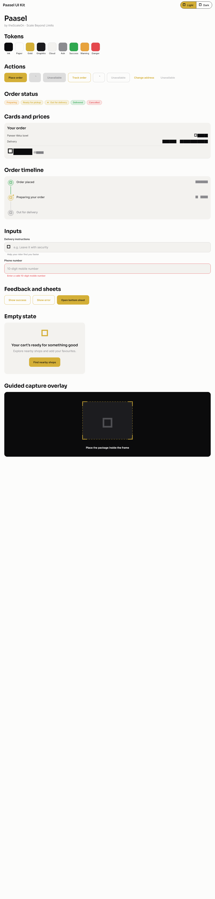
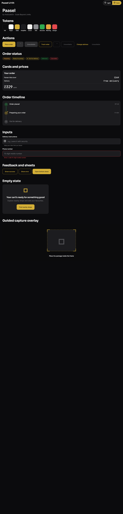

# Paasel UI Kit gallery

Run `flutter run` from this directory to browse every token and shared component. Use the Light/Dark segmented control in the app bar to inspect both complete themes.

## Light theme

## Dark theme

